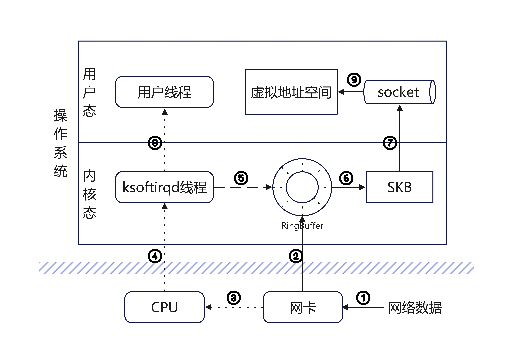

---
title: 探究Linux网络通讯（一）
date: 2025-02-28 20:00:00
tag:
  - Linux
  - 网络编程
  - 计算机原理
------

## 1. Linux收发消息全景图

1. 数据帧从外部网络到达网卡
2. 网卡通过DMA直接把数据帧写入RingBuffer
3. 网卡通过硬中断通知CPU收到消息
4. CPU响应硬中断并创建软中断
5. ksoftirqd线程处理软中断调用网卡驱动poll函数开始收包
6. 收到的数据打包为skb
7. 协议栈处理数据并放入socket连接的接收队列中
8. 内核通知用户线程消息到达
9. 用户线程从socket中拉取数据

## 2. Linux是如何接受消息的

### 2.1. 关键参与者

**ksoftirqd线程**，负责处理软中断，调用poll函数从RingBuffer中拉取数据，将数据包装成skb传递给协议处理函数。一般和CPU核心一一绑定。

**网卡**，负责接收消息，通过DMA将消息写入RingBuffer暂存，向CPU发起中断通知

**网卡驱动**，负责对接DMA和poll函数

**协议栈程序**，负责按照协议要求的行为处理数据，并向后端传递

### 2.2. 准备工作


start
:创建ksoftirqd线程;
:注册协议栈处理函数;
:初始化网卡设置;
:启动网卡;
end


#### 2.2.1. 创建softirqd内核线程与初始化

#### 2.2.2. 协议栈注册

#### 2.2.3. 网卡初始化

#### 2.2.4. 启动网卡

### 2.3. 接收消息


网卡 -> RingBuffer : DMA
RingBuffer --> 网卡
网卡 -> CPU : 发起硬件中断
CPU --> 网卡 : 调用中断处理程序
网卡 -> ksoftirqd : 发起软中断
ksoftirqd -> ksoftirqd : 关闭硬中断
ksoftirqd -> ksoftirqd : 调用poll函数收包
ksoftirqd -> ksoftirqd : 数据传递给协议处理函数ip_rcv
ksoftirqd -> ksoftirqd : ip_rcv传递给udp_rcv


#### 2.3.1. 硬中断处理

#### 2.3.2. 软中断处理

#### 2.3.3. 协议栈处理

#### 2.3.4. IP处理