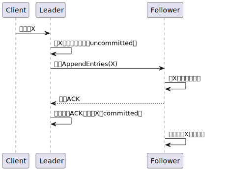

## 1. 引言：为什么我们需要共识算法？

> 想象一个没有十字信号灯的路口，车辆（节点）各自决定何时通过，如何通过，且大家都只考虑自己不考虑其他人。那么最终可能的结果有：1. 正常通过；2. 碰撞（数据冲突）；3. 互相等待对方先动（死锁）。如果个别车辆故意逆行，撞击其他车辆（拜占庭节点），路口将更为混乱。我们需要一种机制，可以有效协调参与者行动，如同信号灯和交规保护路口正常通行一样，保证所有参与者（无论正常节点还是恶意节点）有序协作。

### 1.1. 分布式系统的核心挑战

在分布式系统中，多个节点（服务器、服务或设备）需要协同工作以实现共同目标。然而，这种协同并非易事，因为分布式环境天然面临以下问题：

#### 1.1.1. 网络不确定性

在分布式环境下，我们无法确保网络在任何时候都是可靠的。从简单的跨节点网络问题到跨AZ网络故障，主要存在以下两类情况：

- **延迟与丢包**：节点间的通信可能因为网络拥塞、硬件故障或者距离问题出现延迟或丢包，导致消息无法及时传递。例如，一个节点可能因为延迟误判另一个节点已经宕机，从而触发不必要的恢复流程。
- **网络分区（如脑裂）**：当网络被分割成多个孤立区域时，不同分区的节点可能因为无法通信而各自为政，形成数据冲突（如在不同分区对相同key写入了不同的内容）。

#### 1.1.2. 节点不可靠性

节点的不可靠性可能表现为多种形式，从最简单的故障到复杂的恶意行为有如下几种类型：

- **宕机与重启**：常见的硬件故障、软件崩溃或者人为操作（如用户操作触发严重BUG，运维人员误操作）都可能导致节点突然宕机，失去和系统的通信，并在重启后需要重新加入系统。
- **性能波动**：节点可能因为负载过高，资源争用或者配置差异导致响应速度不一致，临时的拥塞导致无法向上下游提供正常服务，从而引起故障的蔓延，进而破坏整个系统的协调性。
- **拜占庭将军问题**：节点可能故意发送错误信息、伪造数据或恶意破坏系统。这些叛变的节点发送矛盾指令会导致系统无法达成一致。

#### 1.1.3. 时序与状态同步难题

受到网络不确定性和节点不可靠性影响，在实际业务执行过程中就会遇到如下问题：

- **时序问题**：由于网络不可靠和物理设备天然存在的差异，分布式节点不可能完全依赖自身的物理时钟，也就没有办法判断消息/事件的先后顺序。除非有额外的时间同步机制保持各个节点时钟一致，或者统一使用外部高精度时钟服务。
- **局部状态不一致**：若节点间的数据副本为及时同步，用户可能读到过期数据，或因为写入冲突导致数据丢失。

#### 1.1.4. 一致性与可用性权衡

分布式系统设计经过多年发展，行业对于分布式系统本质特点逐渐形成CAP理论。在实践中，系统需根据场景权衡取舍。共识算法的核心目标是在容忍分区的同时，尽可能实现一致性与可用性的平衡。

##### ​​核心原则​​

**​​一致性（C）**​​：所有节点在同一时间看到相同的数据。
​**​可用性（A）**​​：每个请求都能获得响应（不保证数据最新）。
​**​分区容错性（P）**​​：系统在网络分区时仍能运行。
​​**CAP定理​**​：在分布式系统中，​​三者不可兼得​​，必须舍弃其一。

##### 取舍场景

|选择|典型系统|适用场景|缺点|
|---|---|---|---|
|CA（放弃P）|单机数据库（如MySQL）|非分布式场景，强一致性需求高|无法容忍网络分区故障|
|CP（放弃A）|Zookeeper、HBase|需要强一致性的分布式系统（如金融交易）|分区时部分节点不可用|
|AP（放弃C）|Cassandra、DynamoDB|高可用性优先（如社交网络、实时分析）|数据短期不一致（最终一致性）|

##### CAP与ACID的关系

**ACID的一致性（C）**：业务逻辑层面的约束（如余额不为负）
**CAP的一致性（C）**：数据副本之间的强一致性（所有节点数据相同）
**冲突点**：由于业务中ACID的强一致性要求，在分布式系统中为了保证一致性（C）可能违反CAP的可用性（A）或分区容错性（P）

### 1.2. 典型案例的困境

#### 1.2.1. 分布式系统中的原子性问题

在分布式系统中，多个服务实例需要竞争同一共享资源（如修改全局配置、抢购库存），必须保证同一时刻仅有一个实例能持有锁，否则会导致数据错误。

##### 问题与挑战

1. 锁的可靠性：若锁服务出现单点故障，所有依赖的业务将不可用。
2. 锁的误释放：若持有锁的节点崩溃，锁kennel无法释放，导致系统死锁。
3. 锁的状一致性：网络延迟或者脑裂时，多个节点可能误判自己持有锁。

##### 共识算法的解决方案

以Raft为例：

- 锁服务实现逻辑：
  - 集群选举Leader，所有锁请求由Leader协调处理。
  - Leader为每个锁分配全局递增的版本号，确保操作顺序一致性。
- 锁的获取和释放：
  - 获取锁：客户端向Leader发起请求，若锁未被占用，Leader将锁状态写入多数节点后返回成功。
  - 租约机制：锁绑定租约时间，客户端定期续约；若节点宕机，租约超时后自动释放。
- 结果：
  - 强一致性保证锁的原子性，避免并发冲突
  - 租约机制放置死锁，Raft容错机制保障锁服务高可用

##### 典型系统

Etcd、Zookeeper（ZAB协议）

#### 1.2.2. 微服务架构：共识算法实现服务发现

在微服务架构中，服务实例动态锁扩容，客户端需要实时感知可用实例列表。

##### 问题与挑战

1. 服务状态同步延迟：若部分节点记录的实例列表过期，客户端可能请求已下线的节点
2. 脑裂问题：网络分区时，不同区域的注册中心可能维护不一致的服务列表

##### 共识算法的解决方案

以Consul为例：

- Raft与Gossio分层设计：
  - Raft层：用于Leader选举和强一致性数据（如服务注册信息）的写入，确保关键操作全局一致
  - Gossip层：通过随机广播快速传播节点健康状态（如心跳检测），实现最终一致性
- 服务注册和发现流程
  - 服务注册：新实例向Leader节点注册，信息经Raft同步到多数节点后生效
  - 健康监测：Gossip协议周期性的交换节点存活状态，故障节点被标记从服务列表中驱逐
- 结果：
  - Raft保证服务注册信息的一致性
  - Gossip实现大规模集群的高效健康检测，容忍网络波动

##### 典型系统：

Consul（Raft+Gossip）、Nacos（Raft）

#### 1.2.3. 分布式存储系统：维护集群健康与数据完整性

分布式存储系统（如TiDB、Ceph）需管理海量数据分片，确保数据写入所有副本、故障节点自动剔除、新节点加入后数据均衡

##### 问题与挑战

1. 副本一致性：若部分节点写入失败，数据可能丢失或失败
2. 节点故障恢复：如何快速检测故障节点并重新分配数据
3. 元数据一致性：数据分片的位置、副本状态等元数据信息需要全局一致

##### 共识算法的解决方案

以TiDB为例：

- Raft维护数据副本一致性：
  - 每个数据分片对应一个Raft组，Leader负责接受写入请求并同步日志到副本
  - 写入需多数副本确认，确保即使少数副本宕机，数据仍可恢复
- PD（Placement Drive）集群管理
  - PD节点组成Raft集群，维护全局元数据（如数据分布、节点状态）
  - 定期通过心跳检测节点健康，故障节点上的数据由Raft组自动切换Leader并补充副本
- 数据均衡和扩容
  - 新节点加入时，PD通过Raft共识决策，将部分数据分片迁移到新节点，避免热点集中
- 结果
  - Raft保证数据副本的强一致性
  - 共识算法维护的元数据集群实现自动化故障恢复和负载均衡

##### 典型系统

TiDB（Raft）、Ceph（Paxos变种）

## 2. 共识算法的原理

### 2.1. 共识问题的定义

#### 2.1.1. 基本要求

在分布式系统中，共识算法的核心目标是让一组节点在存在网络延迟、节点故障等不可靠因素的环境下，​**​对某个值达成一致​**​。这种一致性需要满足以下基本条件：

1. **​Agreement（一致性）**​​：所有正常节点最终必须接受相同的决策结果
2. **​​Validity（合法性）**​​：决策结果必须由至少一个节点提出，不能凭空产生
3. **Termination（可终止性）**​​：算法必须在有限时间内完成决策
4. **Fault Tolerance（容错性）**​​：允许部分节点故障（通常容忍不超过N/2的节点失效）

**典型应用场景包括**:

- 集群选主（Leader Election）
- 确定日志的全局顺序（如分布式数据库）
- 保证数据副本的最终一致性（如区块链）

#### 2.1.2. 经典模型

**拜占庭将军问题 vs 非拜占庭模型**

||拜占庭模型|非拜占庭模型|
|---|---|---|
|节点行为|可能发送任意错误/恶意消息|仅限崩溃故障（Crash Fault）|
|容错能力|需要2/3以上诚实节点|通常容忍N/2节点故障|
|典型算法|PBFT, PoW, HoneyBadgerBFT|Paxos, Raft, ZAB|
|应用场景|公链、军事系统|企业级分布式系统|

**关键差异​**​：拜占庭模型需要防范恶意节点发送矛盾信息（如双重支付攻击），而非拜占庭模型只需处理节点宕机或网络分区问题。

### 2.2. 共识算法的核心机制

#### 2.2.1. 多数派原则（Quorum）：

通过​**​多数节点的确认​**​覆盖少数异常状态，是规避脑裂问题的核心方法。例如：

- 在5节点集群中，3个节点形成多数派（Quorum Size = ⌈N/2⌉ +1）
- 读写操作需要获得多数节点的ACK确认
- 著名的"NWR"配置：设置写确认数（W）与读确认数（R），保证W + R > N

#### 2.2.2. 任期与心跳机制：

- **​逻辑时钟（Term）**：每个Leader分配一个递增的任期编号，防止过期的Leader发起提案
- **​心跳保活​**​：Leader定期发送心跳包，若Follower超时未收到则触发新一轮选举
- **​随机选举超时**​​：Raft通过150-300ms的随机延迟，大幅降低多候选人的冲突概率

#### 2.2.3. 日志复制与状态机模型

通过严格的日志顺序复制，所有节点最终执行相同指令序列，实现状态机一致性。

### 2.3. 共识算法的分类

#### 2.3.1. 强一致性算法

**设计哲学​**​：优先保证一致性（CP in CAP），牺牲部分可用性

##### Raft

- 角色划分：Leader/Candidate/Follower
- 选举流程：每个Term只允许一个Leader
- 日志同步：强制要求新Leader包含所有已提交日志

##### Paxos

- 两阶段协议：Prepare阶段收集承诺，Accept阶段确认值
- 无中心节点：允许并发提案，通过提案编号解决冲突
- 理论基石：被证明是解决分布式共识的最优算法

#### 2.3.2. 最终一致性协议

**设计哲学​**​：优先保证可用性（AP in CAP），容忍短暂不一致

##### Gossip协议

- 传播方式：节点随机选择邻居广播更新（类似流行病传播）
- 收敛速度：O(logN)轮传播后全网达成一致
- 典型应用：Cassandra的节点状态同步、Redis Cluster