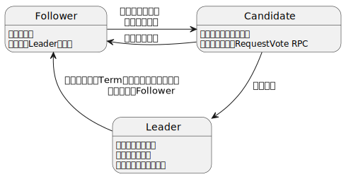

---
title: 如何构建分布式系统（二）
subtitle: Raft算法论文精读
date: 2025-04-22 12:00:00
tag:
  - raft
  - 分布式系统
  - 共识算法
------
## 1. 论文背景和动机

### 1.1. Paxos的困境

Paxos的核心问题在于其​​理论完备性与工程可用性的割裂​​——它提供了分布式共识的理论下限证明，但未构建面向实际系统的设计范式。这种割裂导致开发者需在正确性、可理解性和工程效率间艰难权衡，最终催生了Raft等更强调直觉、模块化和强Leader协调的新一代共识算法。

#### 1.1.1. 算法复杂且认知成本高昂

**1. 理论晦涩难懂**

Lamport的原始论文采用"Part-Time Parliament"隐喻，抽象且缺乏工程视角的描述，导致核心逻辑（如单决策Paxos的两阶段协议）难以直观理解。后续简化版本（如"Paxos Made Simple"）虽尝试降低门槛，但依然需要大量数学推导支撑，学习者需付出极高认知成本。

**2. 教学与理解成本过高**

调查显示，即使经验丰富的开发者和研究人员也难以完全掌握Paxos。其单决策模型（single-decree）与多决策扩展（multi-Paxos）的割裂式设计，使得学习者无法通过模块化分解建立系统性认知。例如，单决策的Prepare/Accept阶段缺乏独立语义，必须整体理解才能推导正确性。

**3. 缺乏实践直觉**

Paxos的证明导向设计侧重于理论完备性，但未提供直观的操作流程（如日志如何连续提交）。开发者难以将抽象协议映射到现实系统的日志复制、成员变更等需求，形成"理论正确但无从下手"的困境。

#### 1.1.2. 工程化实现充满挑战

**1. 但决策到多决策的断层**

Paxos核心仅解决单值共识，实际系统需扩展为连续日志（multi-Paxos）。但Lamport仅提供思路草图，未明确实现细节（如如何选举稳定Leader、日志压缩机制），导致各系统（如Chubby）自行实现时出现碎片化方案，互不兼容且难以验证。

**2. 缺乏标准化实现范式**

不同系统对multi-Paxos的优化策略（如Leader租赁、日志批处理）差异显著，开发者需从零设计状态机、日志回放等组件。论文提到Chubby开发者直言"最终系统基于未经证明的协议"，反映出理论模型与实际需求间的巨大落差。

**3. 调试与运维复杂度**

Paxos的对称式节点设计（无固定Leader）导致运行时状态空间庞大，异常场景（如网络分区后恢复）易引发边界条件问题。工程中需额外引入监控工具和启发式规则，进一步增加系统复杂性。

#### 1.1.3. 架构设计与现实需求的错位

**1. 对称架构存在效率瓶颈**

Paxos的节点对等设计虽在理论上优雅，但实际系统普遍依赖Leader协调以提升性能（如Google Spanner）。Paxos的对称式决策流程在连续请求场景中产生冗余通信，而临时Leader优化又破坏理论纯度，导致实现时需权衡正确性与性能。

**2. 日志管理机制不符合实践**

实际系统依赖顺序追加日志保证一致性，而Paxos的独立决策模型允许日志空洞（如图7中的Follower日志差异）。这迫使开发者引入额外机制（如日志补全、冲突合并），违背"复制日志即状态机"的自然直觉。

**3. 成员变更机制缺失**

原始Paxos未定义集群配置变更协议，实践中需依赖外部协调服务或定制化扩展（如Lamport提到的α协议）。此类补丁方案通常破坏安全性约束（如允许双主），与Paxos的理论保证存在冲突。

### 1.2. Raft的设计目标

Raft的设计目标体现了​​系统思维的三重突破​​：

​**​教学友好性**​​：将共识算法从数学证明转变为可分解教学的工程实践
​**​实现完备性**​​：提供从理论到代码的完整工具链，降低工程化门槛
​**​性能均衡性**​​：在保证效率基线的前提下，优先选择利于人类理解的实现方案
这种设计理念使得Raft不仅是一个算法突破，更开创了分布式系统设计的新范式——将可理解性作为核心约束条件，重塑了学术界与工业界在共识算法领域的协作方式。后续衍生实现（如etcd的Raft库）的成功验证了该目标的实际价值。

#### 1.2.1. 可理解性优先

**1. 认知心理学导向**

​**​问题解耦**​​：将共识拆解为独立子问题（Leader选举/日志复制/安全性），每个模块可独立教学。如选举模块仅需理解超时机制和随机退避策略，无需涉及日志一致性。
​​**状态简化**​​：强制日志连续性（禁止空洞），将可能的状态组合从指数级降至线性。例如Follower日志只存在前缀匹配或全匹配两种状态，而非Paxos的多版本交织。

**2. 直觉化机制设计**

​​**强Leader中心化**​​：所有日志流动为单向（Leader→Follower），消除Paxos中Proposer/Acceptor角色切换的认知负担。类比MySQL主从复制，开发者可快速建立心智模型。
​**​显式状态机**​​：定义清晰的服务器状态转换规则（Follower/Candidate/Leader），通过有限状态机图（图4）可视化节点行为，避免Paxos隐含的博弈论推导。

**3. 教学验证支撑**

​**​用户研究数据​**​：论文通过双盲实验证明，学习Raft后学生正确率比Paxos高23.5%（25.7 vs 20.8/60分）。这验证了模块化设计对认知负荷的降低效果。

#### 1.2.2. 可落地可闭环的工程设计

**1. 生命周期覆盖**

功能模块|Raft实现方案|Paxos实现现状
---|---|---
成员变更|联合共识(joint consensus)|需外部协调或定制方案
日志压缩|快照+InstallSnapshot RPC|无标准规范
客户端交互|线性一致性读优化（心跳验证Leader合法性）|依赖额外lease机制

**2. 实现确定性保障**

​**​精确协议规范**​​：图2给出完整的RPC定义与状态转换规则，消除二义性。如AppendEntries不仅用于日志复制，还承载心跳功能，通过entries[]为空区分。
​**​边界条件处理​**​：显式定义各类异常场景（图7的日志冲突），给出确定解决流程。例如Leader对nextIndex的递减重试策略，避免Paxos中活锁风险。

**3. 工业级验证**

​​参考实现完备性​​：Raft参考实现（LogCabin）包含2000行C++核心代码，完整实现日志压缩、成员变更等特性，被RAMCloud等系统采用。
​​形式化验证​​：通过TLA+对Log Completeness等属性进行机器证明，确保理论正确性与实现一致性。

#### 1.2.3. 性能对等Paxos

**1. 关键优化手段**

- **​心跳复用**​​：将Leader保活与日志复制合并为AppendEntries RPC，避免Paxos中独立心跳消息的开销。
- **​并行化提交**​​：Leader在发送AppendEntries时异步等待多数响应，与后续请求处理重叠。
- **​日志批处理**​​：支持将多个客户端请求打包为一个日志条目，减少网络报文数。

**2. 性能-可理解性权衡**

虽放弃某些理论优化（如EPaxos的并行提交），但通过约束设计保证可理解性：

- ​**​强排序日志​​**：放弃乱序提交可能带来的吞吐提升，换取日志线性增长的直观性。
- ​**确定重试策略**​​：采用nextIndex递减而非复杂历史追溯，牺牲部分网络效率但简化故障恢复逻辑。


## 2. 核心设计思想

### 2.1. 问题分解策略

Raft​​将复杂的共识算法解耦为三个独立且逻辑连贯的子问题：Leader选举、日志复制和安全性保障。这种分层设计极大降低了系统复杂度，使各模块可独立分析、验证和优化。以下从机制设计、技术实现和理论保障三个维度进行深度拆解：

#### 2.1.1. Leader选举（强领导机制）

**1. 设计哲学**

​**​强Leader中心化**​​：与Paxos的对称式设计不同，Raft​​强制唯一活跃Leader​​，所有决策集中由其发起，消除多Leader竞态带来的复杂性。
​**​确定性状态转换**​​：节点仅能在Follower、Candidate、Leader三者间转换，状态机简单明确（见图4）。

**2. 核心机制**

- **​随机化超时选举**​​：
  - **​心跳驱动**​​：Leader周期性广播心跳维持权威。Follower在​​选举超时（150-300ms随机）​​未收到心跳时发起选举。
  - **​随机化避让**​​：各节点超时随机化，避免大规模​​活锁（Split Vote）​​。实验表明仅5ms随机化即可将选举成功率提升至95%+（见图16）。
- **​RPC投票约束**​​：
  - **​Term递增**​​：每次选举递增Term，确保旧Leader失效。
  - **日志完整性检查**​​：Candidate需携带最新日志信息（lastLogIndex/lastLogTerm），Follower仅投票给​​日志至少与自己一样新​​的Candidate（安全性基础）。

**3. 理论保障**

- **​选举安全性（Election Safety）**​​：同一Term至多一个Leader，通过RPC的Term校验和​​先到先得投票​​实现。
- ​**Leader完备性（Leader Completeness）**​​：当选Leader必然包含所有已提交日志条目，通过日志比对约束保证。

#### 2.1.2. 日志复制（单项传播）

**1. 设计哲学**

- **​单向数据流**​​：仅Leader可追加和推送日志，Follower被动接收，消除Paxos多写者冲突。
- **​连续日志模型​​**：日志条目严格顺序追加，消除空洞（与Paxos允许空洞相反），简化回放逻辑。

**2. 核心机制**

- **​增量同步协议​**​：
  - **​AppendEntries RPC**​​：Leader携带prevLogIndex/prevLogTerm验证Follower日志连续性，冲突时​​回溯nextIndex​​直至找到一致点，删除冲突条目后追加新日志。
  - **批量提交优化**​​：支持单次RPC批量发送多个日志条目，提升吞吐量。
- **提交规则**​​：
  - **​多数派提交**​​：当某日志条目被​​半数以上节点持久化​​，Leader将其标记为已提交（Committed）并通知Follower应用。
  - **Leader提交推进​**​：Leader维护commitIndex，按​​日志匹配原则（Log Matching）​​更新。

**3. 理论保障**

- **日志匹配性（Log Matching）**
  - **​同Index/Term条目一致​**​：若两节点在相同Index的Term一致，则此前所有日志必然一致（归纳法证明）。
  - **强一致性检查​​**：AppendEntries中的prevLogIndex/prevLogTerm构成​​前向验证链​​，确保日志连续性。

#### 2.1.3. 安全性保障（状态机安全）

**1. 设计哲学**

- **​状态机线性化**​​：所有节点按相同顺序应用相同日志，确保外部一致性。
- **​提交传播原子性**​​：已提交日志不可回滚，即使发生Leader切换。

**2. 核心机制**

- **​选举约束（Election Restriction）​**​：
  - **日志最新性比较**​​：Candidate必须携带最新日志（比较lastLogTerm和lastLogIndex），确保新Leader包含所有已提交条目。
  - **Term提交规则**​​：仅允许提交当前Term的日志，旧Term日志通过新Term提交间接确认（避免图8中的已提交日志被覆盖）。
- **状态机安全属性（State Machine Safety）**​​：
  - **​提交后不可变**​​：一旦某个Index的日志被提交，后续Leader必须包含相同条目。
  - **顺序应用**​​：所有节点按Index顺序应用日志，消除执行歧义。

**3. 理论保障**

- **Leader完备性证明**​​：反证法证明任何新Leader必然包含所有已提交日志（见5.4.3节）。
- ​**​安全性归纳**​​：通过数学归纳法证明，若某Index日志被提交，所有更高Term的Leader均继承该日志。

#### 2.1.4. 模块协同与系统视图

**1. 层级交互**

- ​**选举 → 日志​**​：Leader当选后立即发送空心跳（AppendEntries）初始化日志同步。
- **​日志 → 安全​**​：提交规则确保日志被多数派接受后，安全性约束阻止不一致提交。
- **安全 → 选举​**​：日志最新性约束影响选举结果，确保新Leader数据完整。

**2. 异常处理协同**

- **​​Leader宕机**​​：触发选举，新Leader基于日志完整性约束产生，接管后通过AppendEntries修复Follower日志。
- **​网络分区​​**：少数派Leader因无法获得多数派心跳，自动降级为Follower；分区恢复后日志强制对齐。

**3. 性能与安全平衡**

- **​​读写分离**​​：读操作可走Leader本地（线性一致性），写操作需日志复制。
- **流水线优化**​​：并行发送RPC、批量日志复制提升吞吐，不影响安全性。

> **Raft通过​​问题分解+强约束​​的设计，将共识问题转化为可独立验证的子模块：**
> 1. ​Leader选举​​：随机化心跳和日志约束确保唯一有效Leader。
> 2. ​日志复制​​：单向流+连续日志模型简化同步逻辑。
> 3. 安全性​​：选举限制+提交规则构成双重保障。
> 三者环环相扣，既降低认知负担，又通过形式化证明确保正确性，最终实现​​理论严谨性​​与​​工程可用性​​的统一。这种设计范式为后续共识算法（如Multi-Raft、EPaxos）提供了可扩展的基线架构。

### 2.2. 状态空间简化

Raft算法通过系统性设计简化分布式共识问题的状态空间，其核心思想围绕消除非确定性、减少状态冲突可能性及强化一致性约束展开。以下从日志连续性、一致性机制、强约束三个维度深入分析其对状态空间的简化：

#### 2.2.1. 通过线性化日志结构消除日志空洞，压缩状态维度

**1. 强制顺序追加机制​​**

Raft要求**Leader​​严格按顺序追加新日志条目​**​（索引连续递增），禁止任何中间空洞。这与Paxos允许独立确认单个条目形成对比。例如，若Leader当前日志最大索引为5，新条目必须从索引6开始写入，确保所有节点的日志索引连续无跳跃。

**2. ​隐含的日志完整性验证​​**

通过AppendEntriesRPC的prevLogIndex和prevLogTerm参数，Raft强制要求​​**前驱日志条目必须存在且匹配​**​。若Follower在索引i处缺失条目，后续所有i+1及更高索引的追加请求均失败，触发日志回溯修复。这种机制保证日志的连续性成为系统稳态的必要条件。

**3. ​状态空间的指数级缩减​​**

假设系统允许最多N个日志条目，Paxos的日志可能呈现2^N种组合（每个索引存在或不存在），而Raft的连续日志仅允许N+1种状态（日志长度为0到N）。例如，当N=1000时，Raft状态空间规模为1001，而Paxos可达2^1000，差异巨大。

#### 2.2.2. 通过强Leader模型与匹配性原则限制日志不一致

**1. 单向日志同步通道​​**

Raft规定**日志条目只能从Leader流向Followers**​​，禁止Follower主动插入或修改日志。这与VR等允许双向同步的协议不同，消除因多源写入导致的分叉可能。例如，当网络分区恢复时，仅Leader的日志会被最终采纳。

**2. ​日志匹配性定理（Log Matching Property）​​**

Raft证明：若两个日志在相同索引i处具有相同任期，则i之前的所有日志必然完全一致。该性质通过数学归纳法保证：

- **​​基础情形**​​：初始空日志天然匹配
- ​**归纳步骤​**​：每次AppendEntries成功意味着prevLog的一致性，新条目追加后继续维持匹配性

**3. ​不一致状态的有限化​​**

当Follower日志与Leader冲突时，Raft将不一致范围限制在​**​最后一个匹配点之后**​​。如图7所示，差异仅可能存在于日志尾部，而非随机分布。这使得状态修复只需从特定点开始截断，无需处理碎片化不一致

#### 2.2.3. 通过选举与提交的严格规范保证强一致性约束

**1. Leader完备性约束​​**

Raft选举要求候选人日志**至少与大多数节点一样新​**​（通过lastLogIndex和lastLogTerm比较）。例如：
- 任期号更大的日志自动更新
- 同任期时更长的日志更新
这确保新Leader必然包含所有已提交条目，杜绝数据回滚。

**2. ​提交规则强化​​**

Raft规定​**​仅当前任期条目可直接提交**​​，历史条目通过新任期的隐式提交。如图8所示，即使旧条目存储在多数节点，新Leader也需通过提交新条目间接确认旧条目。该机制避免跨任期提交的复杂状态转换。

**3. ​状态机安全边界​​**

通过以下叠加约束，Raft将可能的状态机状态限制在单一路径：
- 日志应用顺序严格按索引执行
- 已应用的日志索引禁止被覆盖
- 提交传播的原子性（commitIndex单调递增）

#### 2.2.4. 设计权衡与工程影响

**1. ​可用性与性能的代价​​**

强一致性约束可能增加选举延迟（需找到足够新的Leader）和日志回溯成本，但通过随机化选举超时和批量追加优化可缓解。例如，实际部署中，Leader批量发送日志条目减少RPC次数。

**2. ​与Paxos的哲学差异​​**

Paxos追求最小化约束（如允许日志空洞），换取理论上的灵活性；Raft主动增加约束，换取实现简单性。如图9所示的用户研究数据，Raft的状态空间简化直接提升了算法可理解性。

**3. ​系统验证的简化​​**

有限的状态空间使形式化验证更易实施。TLA+规范中，Raft的状态变量（如log[]、commitIndex）的变化路径明显少于Paxos，模型检测可覆盖更多边界条件。

>Raft通过​**​结构化日志​**​、**​​强Leader模型**​​和**递进式提交规则​**​，将分布式共识的复杂状态空间压缩到线性可管理的维度。这种设计不仅降低算法理解成本（如图14的用户研究结果），更重要的是为工程实践提供了确定性保障——开发者无需处理指数级的状态组合，只需维护有限的强约束状态，显著降低实现错误风险。这种"以约束换简单"的哲学，正是Raft能在工业界快速普及的核心原因

### 2.3. 随机化机制

#### 2.3.1. 利用选举超时随机化打破对称性防止脑裂

**1. ​数学原理​​**

设集群规模为N，每个节点独立从区间[T_base, T_base + ΔT]中随机选取超时时间（典型值150-300ms）。当多个节点同时检测到Leader失效时，其成为Candidate的时间点服从均匀分布，发生选举冲突的概率为

P_{冲突} = \frac{C(N-1,1) \cdot \int_{0}^{\Delta T} (\Delta T - t)^{N-2} dt}{(\Delta T)^{N-1}}

实验表明，在ΔT=150ms时，5节点集群的冲突概率可降至5%以下。

**2. ​退避策略优化​​**

首次选举失败后，节点采用指数退避算法动态调整随机区间：

T_{new} = [\beta \cdot T_{current},\beta \cdot T_{currrent} + \Delta T](\beta > 1)

通过扩大随机范围降低连续冲突概率，类似以太网CSMA/CD的冲突解决机制。

**3. ​实际效果验证​​**

Raft论文中的基准测试显示（图16），在5节点集群中：

- 无随机化时选举耗时>10秒（频繁冲突）
- 引入5ms随机化后，中位选举时间缩短至287ms
- 50ms随机化使最坏情况降至513ms

#### 2.3.2. 心跳机制与状态及的协同设计

**1. ​心跳驱动的状态转移​​**

Leader通过周期心跳（通常50-100ms）维持统治，Follower状态机维护倒计时器：

```python
while True:
    if time_since_last_heartbeat > election_timeout:
        become_candidate()
    elif received_heartbeat:
        reset_timer()
```

这种显式状态转换比Paxos隐式租约更易调试。

**2. ​QoS保障机制​​**

Leader在负载高峰时动态调整心跳间隔：

T_{heartbeat} = max(T_{min}, \frac{1}{\alpha \cdot throughput})

确保高吞吐场景下仍能及时发送心跳（如日志复制期间保持ΔT < election_timeout/2）

**3. ​网络分区的优雅处理​​**

当发生网络分区时：

- 少数分区节点因无法达到多数票而持续选举失败，最终进入退避状态
- 多数分区快速选出新Leader继续服务
- 分区恢复后，退避机制确保旧Leader自动降级（term编号比对）

#### 2.3.3. 概率模型驱动的收敛优化

**1. Beta分布优化选举窗口​​**

Raft改进版采用Beta分布而非均匀分布生成超时时间：
​
\int(t;\alpha,\beta)=\frac{t^{\alpha-1}(1-t)^{\beta-1}}{B(\alpha, \beta)}

通过调整形状参数（如α=2, β=5），使超时时间集中在区间后半段，进一步降低早期冲突概率。

**2. ​马尔可夫链收敛分析​​**

将选举过程建模为离散时间马尔可夫链，状态转移矩阵为：
​
P_{ij}=
\begin{cases}
\binom{N-1}{j-1}p^{j-1}(1-p)^{N-j}& i = 0\\
0& i \neq 0
\end{cases}
 
其中p为单个节点在ΔT内超时的概率。通过稳态分布计算得出最优ΔT。

**3. ​实际部署建议​​**

网络环境|推荐参数|收敛时间保证
---|---|---
本地数据中心|ΔT=150-300ms, β=2|<1s
跨地域集群|ΔT=500-1000ms, β=1.5|<3s
高延迟卫星链路|ΔT=2000-5000ms, β=1.2|<10s

#### 2.3.4. 与Paxos的对比创新

**1. ​机制简化​​**

Paxos依赖独立Leader选举模块（如Bully算法），而Raft将选举作为共识状态机的自然延伸，减少20%的状态转移路径。

**2. ​​确定性增强​​**

通过强制日志连续性（Log Matching Property）和term编号约束，将Paxos的3种异常场景（过时Leader、日志分叉、元数据损坏）合并为单一恢复路径。

**3. ​可观测性提升​​**

设计专用监控指标:

```prometheus
  raft_election_duration_seconds_bucket{le="0.5"} 0
  raft_election_duration_seconds_bucket{le="1.0"} 12
  raft_heartbeat_miss_total{node="a"} 3
```

相比Paxos的模糊状态（如acceptor/proposer角色转换），更易定位网络抖动等问题。

> Raft通过将随机化机制深度融入核心状态机，实现了：
> 1. ​复杂度与效率的黄金分割​​：在O(1)时间解决Paxos需要O(n)消息交换的选举冲突
> 2. ​确定性与随机性的共生​​：随机化仅用于打破对称性，不影响状态机确定性
> 3. ​理论严谨与工程直觉的统一​​：所有随机行为都有明确的概率模型支撑
> 这种设计哲学为后续算法（如EPaxos、VRaft）提供了可扩展的架构模板，标志着分布式共识从数学证明向工程友好的范式转变。

## 3. 算法核心流程

### 3.1. Leader选举机制

#### 3.1.1. 节点状态与角色转换

- **​Follower​**​：默认状态，被动接收Leader的心跳（AppendEntries RPC）。若超时未收到心跳，转换为Candidate发起选举。
- ​**Candidate**​​：发起选举的临时状态，向其他节点发送RequestVote RPC。若获得多数票则成为Leader；若发现更高term的RPC则退回Follower。
- **Leader**​​：处理客户端请求，管理日志复制，定期发送心跳维持权威。



#### 3.1.2. 触发条件

- **心跳超时**：每个Follower维护一个​​随机化选举超时时间​​（通常150-300ms）。若在超时窗口内未收到Leader的AppendEntries心跳或新日志，则触发选举。
- **随机超时时间**：通过随机超时时间设计可避免多个节点同时超时引发分裂投票（Split Vote），论文指出仅需5ms随机偏移即可显著降低冲突概率

#### 3.1.3. 投票规则

- **RequestVote RPC**​​：Candidate需携带自身日志的最新索引和term。接收节点仅投票给日志​​至少与自己一样新​​的Candidate（比较term和索引）。
- **​多数派原则​​**：Candidate需获得集群多数节点的投票才能成为Leader，确保每个term至多一个Leader（​​选举安全性​​）。

### 3.2. 日志复制流程

#### 3.2.1. 日志结构

每个日志条目包含​​term​​（创建时的Leader term）、​​命令​​和​​唯一索引​​。Leader仅追加日志（​​Leader Append-Only​​），确保日志单调增长。

#### 3.2.2. 日志复制步骤

1. **​客户端请求处理**​​：Leader将命令追加到本地日志，通过AppendEntries RPC并行发送给所有Followers。
2. **一致性检查**​​：每个RPC携带前一条目的索引和term。Follower验证本地日志是否匹配，若不一致则拒绝，Leader回退nextIndex重试（​​日志匹配原则​​）。
3. **提交与通知**​​：当条目被复制到多数节点时，Leader提交该条目并应用到状态机，随后通过后续RPC通知Followers提交。

#### 3.2.3. 日志冲突处理

**​强制覆盖**​​：Leader通过逐步递减nextIndex定位Followers日志中最后一个一致条目，删除冲突部分并追加新条目，确保最终一致性。

### 3.3. 安全性保障机制

#### 3.3.1. 完整性检查

新Leader必须包含所有已提交的日志条目。通过选举时的​​日志最新性检查​​实现：Candidate的日志必须比多数投票节点的日志更新（term更大或term相同但索引更大）。

#### 3.3.2. 提交规则

**​​仅提交当前term的条目**​​：旧term的条目需通过当前term的提交间接提交，避免图8场景中已复制但未提交的条目被覆盖（见5.4.2节）。例如，Leader提交一条当前term的no-op条目后，间接提交之前term的条目。

#### 3.3.3. 状态机安全性

保证同一索引的日志条目在所有节点最终一致。通过​​Leader完整性​​和​​日志匹配原则​​确保：一旦某条目被提交，后续Leader的日志必然包含该条目，且应用顺序一致。

### 3.4. 异常情况处理与风险规避

#### 3.4.1. 节点宕机与恢复

- ​Leader宕机​​：Followers超时触发选举，新Leader产生后继续日志复制。
- Follower/Candidate宕机​​：重启后接收Leader的RPC，通过日志一致性检查同步状态。RPC设计为幂等，重复处理无副作用。

#### 3.4.2. 网络分区与脑裂

- ​term机制​​：低term的Leader收到高term的RPC时会退位，避免多Leader共存。
- 多数派限制​​：仅多数节点在线的分区可选举Leader，确保数据一致性。

#### 3.4.3. 配置变更风险

- 联合共识（Joint Consensus）​​：配置变更时，集群先过渡到新旧配置共存阶段（Cold,new），需新旧多数派同时同意提交，避免中间状态出现双Leader（见第6章）。
- 新节点加入​​：新节点作为非投票成员同步日志，追上后再加入配置，避免可用性下降。

#### 3.4.4. 日志压缩与快照

- 快照机制​​：定期将日志状态保存为快照，删除已提交的旧日志。Leader通过InstallSnapshot RPC向落后Followers同步快照，减少网络传输（见图12）。
