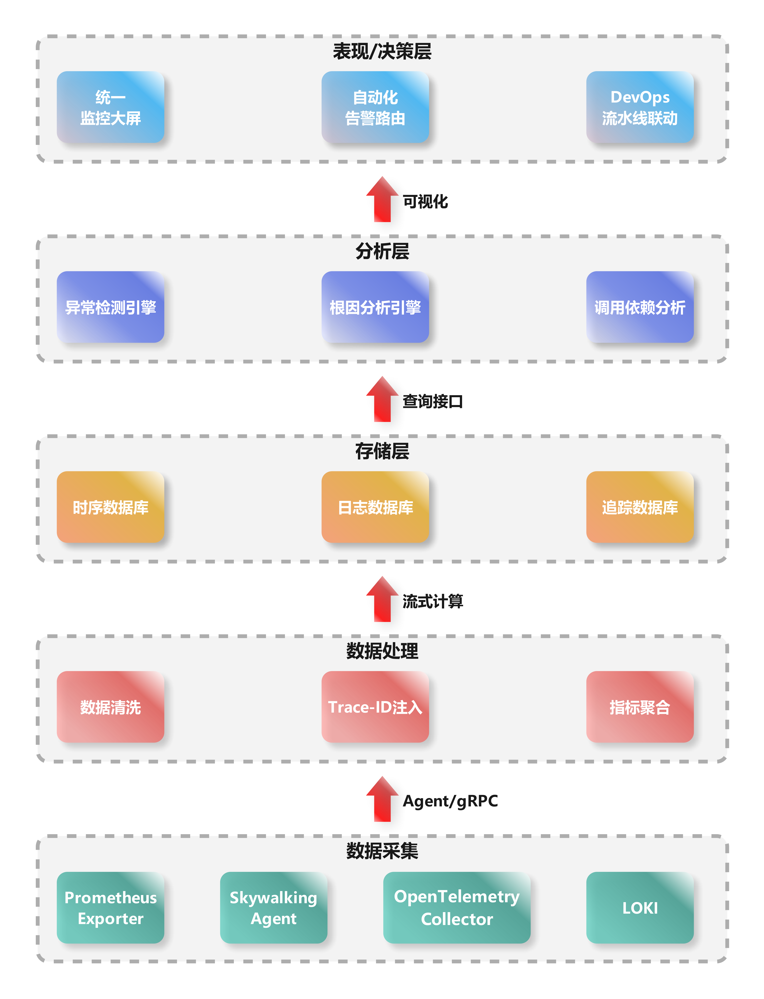

>你是公司数据平台的开发人员，今晚轮到你on Call。当你一边祈祷不要有电话一边入睡后，急促的手机铃声强制让你开机复位。单调的声音不是闹钟胜似闹钟，看着系统自动群发的故障通知，你犹如刚进行完冰桶挑战，睡意一扫而光只留下一身寒颤。
>“有内鬼，终止交易”。
>嗯，系统就是内鬼，海外用户的订单都失败了，但运维找不到问题原因，除了消费速度慢其余什么有价值信息都没有，今夜注定无人成眠。。。。。

上面的例子相信是每一位有on Call经历的小伙伴的梦魇。系统出了问题运维同学们拦不住，要么什么有价值信息都没有上去两眼一抹黑，要么日志、指标还有链路数据分散在各处，就像是还原被碎纸机处理过的机密文件，深陷数据沼泽不能自拔。这时候我们不禁想问：

> **“为什么我们的系统就像是黑匣子？明明有监控，有埋点，有日志，却依然看不清问题？”**

## 1. 深入困局：分布式系统的可观测性挑战

人类对“掌控一切”的欲望，在现代监控系统中展现得淋漓尽致：炫目的仪表盘中数字如洪流般奔腾，告警系统严阵以待。这看似精密的布局下却悄然掩着一个深邃悖论：人类工程师们正陶醉于对复杂系统展开的掌控幻觉，如同在风暴眼中误以为晴空万里——当警报沉默之时，故障却正在酝酿它凶险的舞蹈。

### 1.1. 监控系统的局限性

真正的桎梏在于，监控从来不是可观测性的同义语。我们的系统常以预设标准指标如CPU、内存和网络流量作关键评估标准。如同在黑暗中用探照灯照亮有限的区域，这些预设指标仅为可观测性宏伟图谱上孤立而静止的点位。一个微服务应用中，每个服务实例的CPU都健康无虞，但微妙的流量波动却能如同无声的毒素传导般，在服务网格深处引发一场无声的雪崩。可观测性则是一场立体的探索——以强大的日志(logs)、复杂度量(metrics)、深层跟踪(traces)三位一体编织观察之网；它拒绝被特定维度的预设束缚，允许工程师穿越因果的迷雾、回溯时间脉络，凭借弹性查询灵活构建情境，在混沌中还原清晰的故障图景，在沉默的故障潜伏期揭开真相的面纱。它是一场无休止的追问，是真正拥有系统内在脉搏的钥匙。

监控系统更深层的局限，来自于它对“长尾故障”的无力觉察。长尾故障潜伏于分布曲线延展的末端，如同被风卷落的残云。此类故障由极为罕见的异常组合诱发，或是系统内潜伏微小缺陷的持续积累——当这些因素偶然交织，便成了足以倾覆一切的滔天海啸。比如核心数据库集群在瞬时超高并发下主备切换失败的罕见组合事件，又或者某微服务中一条执行频率极低的消息队列处理逻辑，悄然泄露了微量资源日积月累后耗尽容器内存。预定义指标如系统负载均值、线程池活跃度、接口成功率，几乎无法洞悉这些奇异角落的涟漪。它们只能记录平均值或峰值，捕捉不到那万分之一概率的异常震荡，更无法重构事件链中复杂耦合与连锁反应的真实轨迹。

传统监控如同一位固守于明亮舞台的观察家，对那些边缘黑暗地带中悄然累积、酝酿风险的异常信号视而不见，让其在黑暗掩护中默默壮大。监控有其神圣职责，但它终究只是人类认知世界与系统真相过程中的一个片段、一种工具。清醒面对监控的固有局限，就是放弃全知的幻想，转而拥抱真实的未知与可能的缺陷——如此才能从监控进化到可观测性的深邃境界，实现对系统复杂性的真正理解与驾驭。

在分布式架构迷宫中，​​监控如同照亮预设路径的火把，而可观测性才是可以拨开混沌去追随任何线索的光芒。

### 1.2. 分布式环境下的四大困境

#### 1.2.1. 数据割裂

分布式环境的核心特征是数据的分散性：日志（Logs）记录在单体节点、指标（Metrics）汇聚于Prometheus等工具、链路（Traces）由skywalking或Zipkin捕获——三者分属不同存储和处理系统，时域（时间维度）和空域（空间维度）天然隔绝，关联起来如拼图碎片散落荒野。时域错位源于时钟漂移（Clock Drift），例如NTP同步问题导致某服务器日志时间戳偏差几秒；空域分割则由服务隔离和云区域分布引起，如欧洲节点指标无法直接匹配亚洲链路。这看似细微的割裂，却让根因分析雪上加霜。

其危害在逻辑上无懈可击：数据割裂破坏可观测性的基础——相关性（Correlation）。试想一个电商支付失败场景：用户提交订单，网关日志显示“超时”，但相关链路数据却因空域隔离只记录部分调用路径；同时，CPU指标在另一个系统里峰值异常，但因时域错位（服务器时钟不同步），无法确定哪个服务导致连锁崩溃。简言之，割裂让数据变成孤岛，割据信息“神经末梢”，诊断被迫依赖猜测而非证据。这正是可观测性失灵的起点：如果没有统一时序和位置的关联，分布式系统就沦为数据黑洞。

#### 1.2.2. 上下文缺失

分布式系统中，每个单点数据单元（如一条错误日志或一段微服务链路）都像一幅残缺的地图，无法还原业务全貌（Business Context）。一个请求穿越多个服务，每个组件只能提供“一瞥”，而缺少全局调用链、事务流程或业务ID（如User ID）的连接，单点数据就成了“盲点”。当错误发生时，孤立日志如“数据库连接超时”无法回答关键问题：是哪个上游调用引发？影响了哪些用户？业务场景是什么？这本质上是维度衰减（Dimension Reduction），让诊断沦为臆断，犹如盲人摸象，又如管中窥豹可见一斑。

逻辑上，上下文缺失是可观测性的致命短板。分布式系统基于微服务架构，业务流（如用户登录）分散到认证、计费、存储等服务中。假设一个在线视频平台的缓冲失败告警：某个CDN节点日志显示“延迟激增”，但无链路上下文，不知是用户设备问题还是后台转码服务过载。后果清晰可见：根因分析（RCA）变为高成本试错，MTTR（平均修复时间）飙升。数据若无上下文，就如丢失路标的迷宫，运维人员只能在黑暗中摸索。

#### 1.2.3. 爆炸式复杂度

微服务架构的演进本质是调用链的几何级放大：一个简单请求（如HTTP GET）触发一系列服务调用，形成树状或网状结构，复杂度呈指数级增长。算法理论支持此困境：调用链节点数常为O(2^n)，n为服务层级数。例如，一个电商订单请求，初始网关调用用户服务，后者可能连锁调用库存、支付和推荐服务，每个又依赖数据库或缓存——在100+微服务系统中，单次请求产生数百个调用节点，形成“蛛网式”依赖。

这在实践中引爆可观测性瓶颈。指数复杂度导致trace采样率激增，海量链路数据难以完整存储和处理；同时，调用链的蝴蝶效应让小故障传播如多米诺骨牌。以金融交易平台为例：一个小缓存失效问题（原本可在10分钟修复），因调用链跨越风控、清算和通知服务，数据爆炸让追踪工具超载，最终扩展为全局延迟事故。逻辑上，复杂度放大信息噪音，模糊关键信号——系统如同一个黑盒，内部动态层层遮挡，诊断工具在指数增长面前苍白无力。这是分布式困境的核心体现：可观测性本是“显微镜”，却被复杂度推成“糊涂镜”，运维成本直线上升。

#### 1.2.4. 反馈延迟

前三大困境的交织，必然孕育反馈延迟：问题定位耗时长，MTTR延长，导致业务连续性受损。在分布式环境中，故障定位需要聚合割裂数据、重建上下文、并穿透复杂度迷宫——人工调查流程（如日志过滤、trace分析）动辄数小时甚至数天。例如，一次简单部署Bug引发500错误，由于数据割裂和上下文缺失，SRE团队需手动跨系统查询指标、匹配链路、关联业务场景；若涉及指数级调用链（如百服务级系统），排查可能陷入死循环。

后果逻辑上无可辩驳：延迟直接转化为业务损失。研究表明，生产系统每小时停机平均损失数十万美金。比如电商大促时，支付模块异常导致0.1%错误率，但因反馈延迟，团队耗时6小时定位到数据库热点锁——期间用户流失率上升15%。，一次跨国CDN故障，因数据分散在Region级系统中，反馈延迟超12小时，品牌声誉严重受损。本质上，反馈延迟是前三大困境的“放大器”：它让可观测性从实时护盾降级为事后补丁，运维效率在分布式迷宫中迷失方向。

综上所述，分布式环境下的四大困境——数据割裂、上下文缺失、爆炸式复杂度和反馈延迟——形成一个自加强的闭环：割裂引发上下文缺失，缺失放大复杂度，复杂度加剧延迟。它们不仅是技术挑战，更是业务风险的倍增器，让可观测性平台从诊断利器沦为一纸空谈。作为架构师，我坚信破局之道在于统一平台（如OpenTelemetry标准），构建端到端Trace-Metric-Log融合机制，但这是后话。今天，我们当直面这些隐形杀手：它们不是抽象术语，而是每分秒损耗系统健壮性的真实利刃。只有深刻剖析，方能设计韧性体系，让分布式世界不再“灯下黑”。​​

## 2. 破局的关键：什么是真正的可观测性

在分布式系统的四大困境中突围，必须回归本质问题：​​可观测性（Observability）与监控（Monitoring）的根本差异是什么？​​ 谷歌在《Dapper, a Large-Scale Distributed Systems Tracing Infrastructure》等经典论文中早已揭示：监控回答“系统是否异常”，而可观测性回答“为什么异常”。这一差异，正是破解四大困境的核心密钥。

### 2.1. 谷歌三支柱：LMT三角的协同效应​

谷歌提出的日志（Logs）、指标（Metrics）、追踪（Traces）三支柱模型，并非简单叠加，而是通过​​关联性​​重构数据价值：

1. **​​日志是“发生了什么”的原始证据**​​——记录离散事件（如错误堆栈）。
2. **​指标是“整体状态”的量化抽签​​**——揭示系统健康度（如CPU利用率、QPS）。
3. **追踪是“因果链条”的时空图谱​​**——还原请求全生命周期路径（如微服务调用树）。
​​
三者的化学反应在于关联​​：

- ​**Trace ID作为“数据纽带”​**​：通过唯一ID将日志、指标绑定到同一次请求的追踪链上，破局“数据割裂”。
- **Metrics驱动Trace采样**​​：突增错误率自动触发高密度链路采集，应对“爆炸式复杂度”。
- ​**Logs填充Trace上下文​​**：在调用链节点注入业务标签（如用户ID、订单号），根治“上下文缺失”。

>​​案例​​：谷歌通过Dapper将平均故障定位时间缩短70%。当支付服务延迟飙升时，工程师点击异常指标，直接下钻到问题链路，定位到MySQL慢查询日志——数据割裂被Trace ID缝合，上下文由业务标签还原。

### 2.2. 超越传统监控：从被动告警到主动探索​

传统监控的局限在于“已知的未知”——预设阈值告警（如CPU>90%），但分布式系统的故障常源于“未知的未知”（如跨服务的事务死锁）。真正的可观测性提供两大升维能力：

1. ​​从“是否异常”到“为什么异常”​​
   - 监控是​​状态仪表盘​​（红灯亮了），可观测性是​​诊断工具箱​​（用X光查病灶）。
   - 例如：传统监控发现API 500错误率上升，但可观测性通过Trace发现是网关→认证服务→数据库的链式超时，且日志显示认证服务缓存击穿。
2. 从“被动响应”到“主动探索”​​
   - 监控依赖预定义规则，可观测性支持​​无预先假设的探查​​：
     - 动态下钻​​：从全局指标异常（如订单失败率突增）穿透到单次异常请求的完整链路。
     - 多维切面​​：按业务属性（地域、用户等级）过滤追踪数据，重建业务场景上下文。
​​

> 反例​​：某电商大促时，监控系统因预设阈值不足，未捕获到区域性订单失败（总量未超阈值）。而可观测性平台通过Trace+Log的关联分析，主动发现某地域的库存服务因网络丢包频繁超时——这正是传统监控的盲区。

### 2.3. 可观测性的终极目标：支持高熵系统中的持续探索​​

分布式系统的复杂性本质是​​熵增​​——服务、链路、状态的组合爆炸不可穷尽。可观测性的使命是提供“熵减工具”：

1. ​​通过探索降低定位成本​​
   - 谷歌SRE团队用​​分布式调试器​​比喻可观测性：像代码调试一样设置断点（关键服务节点）、查看变量（日志/指标）、单步执行（链路跳转），将MTTR从小时级压至分钟级。
2. ​通过关联对抗信息碎片​​
   - 建立​​统一数据湖​​（如基于OpenTelemetry），使日志、指标、链路原生同源——数据割裂在入口处消解。
3. ​通过上下文还原业务真相​​
   - 注入​​业务语义​​（如购物车操作、支付阶段）到Trace中，让技术数据映射业务影响。

> ​​实证​​：Netflix通过全链路可观测性平台，实现故障根因自动定位：当视频缓冲异常时，系统自动关联用户设备日志、CDN指标、编码服务追踪，准确识别出安卓客户端的H264编解码兼容问题。

### 2.4. 可观测性——分布式时代的“认知革命”

四大困境的根源是系统的“不可知”。真正的可观测性，本质是​​通过LMT的协同关联，将系统转化为可被持续探索的开放模型​​。它不满足于“系统是否活着”（监控的战场），而是追求“系统为何如此运行”——这一能力直接决定分布式架构的生存韧性。

正如谷歌所实践：​​当Trace串联起碎片数据，当Log赋予业务含义，当Metric驱动智能采样，运维者便从“救火队员”进化为“系统侦探”​​，在分布式迷宫中手持三棱镜，将混沌折射为清晰的光谱。这不仅是技术升级，更是一场从被动防御到主动认知的革命。

## 3. 可观测性架构设计原则

### 3.1. 核心架构分层

#### 3.1.1. 数据采集层：破除数据割裂的第一道防线​

- **核心组件**​​：Prometheus Exporter（指标）、Skywalking Agent（链路）、OpenTelemetry Collector（多信号兼容）、LOKI（日志）
- **关键设计**​​：
  - **统一探针框架​**​：通过OpenTelemetry标准化采集协议，使日志、指标、链路在源端实现协议对齐，奠定关联基础。
  - **异构环境适配**​​：Agent与Exporter并存，兼容虚拟机/K8s/Serverless等环境，消除数据空域隔阂。
- **破局价值​**​：

> 原生支持Trace-ID注入（见数据处理层），将分散在节点/服务的异构数据绑定到同一次请求，为后续关联分析锚定时空坐标系。

#### 3.1.2. 数据处理层：构建数据关联的枢纽​

- ​**核心操作​​**：数据清洗（去噪/格式化）、Trace-ID注入（核心！）、指标聚合（降采样）
- **关键技术​**​：
  - Trace-ID作为“**数据缝合线**”​​：在清洗阶段强制注入唯一ID，使日志错误、服务延迟指标、调用链路可基于同一ID关联。
  - **流式计算（如Flink）**​​：实时聚合原始指标（如每秒百万级数据点→千级时序），解决爆炸式数据量问题。
- ​**破局价值**​​：

> 将原始数据转化为富含上下文的结构化信息（如带Trace-ID的错误日志），直接克服“上下文缺失”和“数据割裂”。

#### 3.1.3. 存储层：针对数据特性的定制化存储​

- ​​存储策略​​：

|**数据类型**|**存储引擎**|**设计逻辑**|
|---|---|---|
|指标（时序）|Prometheus/TSDB|列式存储+时间窗口压缩，支持高速聚合|
|日志|Elasticsearch|倒排索引实现模糊文本检索|
|追踪链路|Jaeger/Cassandra|高吞吐写入，支持毫秒级Span查询|

- ​​破局价值​​：

> 分离存储避免“一刀切”性能瓶颈。通过统一查询接口（如OpenTelemetry API）实现跨存储关联，消除运维检索时的数据孤岛。

#### 3.1.4. 分析层：可观测性的智能引擎​

- 三大核心能力​​：
  1. 异常检测引擎​​：基于机器学习（如季节性分解算法）区分真实异常与噪声波动。
  2. 根因分析引擎（RCA）​​：通过调用依赖图谱+Trace-ID关联，自动定位故障源（如“Service A超时→引发Service B线程池耗尽”）。
  3. 调用依赖分析​​：动态构建服务拓扑，识别循环调用等风险模式。

- ​​破局价值​​

> 从海量数据中自动提取因果关系，将“反馈延迟”从小时级压缩至分钟级，根治爆炸式复杂度引发的分析瘫痪。

#### 3.1.5. 表现/决策层：闭环运维的最后一步​​

- ​能力矩阵

|功能模块|关键价值|
|---|---|
|统一监控大屏|聚合全局指标/日志/链路，秒级可视化业务状态|
|自动化告警路由|基于根因分析结果推送精准告警（如“通知DBA而非前端团队”）|
|DevOps流水线联动|故障结果自动触发CI/CD回滚或扩容|

- 破局价值

> 将分析结果转化为决策指令，实现“监控→诊断→修复”的自动化闭环，让可观测性真正驱动业务韧性

#### 3.1.6. 架构设计的全局价值

此分层结构通过三大核心逻辑解决分布式困境：

1. ​​纵向解耦​​：各层独立演进（如存储层替换无需改动采集层），提升系统可维护性。
2. 横向协同​​：Trace-ID贯穿全栈，使割裂的数据在分析层汇聚为完整业务故事。
3. 智能下沉​​：将根因分析、异常检测等计算密集型操作收敛至专用层，避免终端资源过载。

### 3.2. 关键设计原则

在现代分布式系统的复杂迷宫中，可观测性平台的设计需遵循五项黄金原则。它们不仅是技术选择，更是对运维本质的深刻洞察——​​将数据噪声转化为决策智慧​​。

#### 3.2.1. 统一数据标准——消灭数据巴别塔​

##### ​核心逻辑​

数据割裂源于各组件自建“方言”（如Jaeger的Span格式、Prometheus的Metric规范）。统一采用​​OpenTelemetry（OTel）规范​​如同为可观测性定义“世界语”。

##### ​​工程实现

- 语义约定（Semantic Conventions）​​：强制统一资源属性（如`service.name`、`k8s.pod.id`），使日志、指标、链路共享业务和技术元数据。
- 跨信号关联​​：通过Trace_ID和Span_ID在协议层绑定三类数据，天然破局“上下文缺失”。

##### 价值实证​​

> 某银行微服务改造后，未统一标准时需写47个数据转换器；采用OTel后，故障排查中的数据关联耗时减少90%。

#### 3.2.2. 无侵入采集——零负担的数据洞察​

##### 技术支柱

|技术|适用场景|价值|
|---|---|---|
|​eBPF​|内核级网络流量追踪（如TCP重传）|无需改代码抓取四层协议异常|
|​​Service Mesh​|服务通信层自动埋点（如Istio）|全链路追踪与流量控制一体化|
|​Sidecar|日志/指标代理（如FluentBit）|应用零侵入，资源隔离|

##### 破局效果

> 无侵入设计直击“爆炸式复杂度”：某电商平台接入Istio后，500+微服务的调用链追踪覆盖率从35%升至100%，且开发迭代效率不受埋点影响。

#### 3.2.3. 弹性数据处理层——流式计算引擎的洪峰驯化​

##### 架构设计

原始数据洪峰 → Kafka（缓冲）→ Flink（实时窗口计算）→ 降维聚合

##### 关键能力

- 动态采样​​：基于规则（如错误率>5%时全量采集）或AI预测自动调整Trace采样率，避免存储过载。
- 突刺吸收​​：利用时间窗口聚合原始指标（如1秒内10万条日志→ 按错误类型统计的时序点），抗流量脉冲。

##### 效能对比

> 某社交平台春晚活动时，流处理层将每秒200万条原始日志压缩为5000个时序指标，存储成本降低99%，分析延迟<2秒。

#### 3.2.4. 多模态存储引擎——对症下药的存储范式​

##### 场景化存储矩阵

|数据类型|存储引擎|优化目标|
|---|---|---|
|​指标(TSDB)​|promethues|高压缩率+毫秒级聚合|
|​日志|Loki（索引冷热分离）|低成本全文检索|
|​追踪链路|skywalking+对象存储（S3）|低成本长周期存储|

##### 成本效益实证

> 对比单一ES集群方案，多模态存储使某云厂商的年存储成本从230万降至41万，查询性能提升3倍。数据不再因成本受限，根治“反馈延迟”。

#### 3.2.5. AIOps整合——从被动响应到主动防御​

##### 智能能力分层注入​

##### 关键算法赋能​​

- SLO-Adviser​​：基于历史指标预测SLO违约风险（如未来30分钟错误率>0.01%的概率），提前扩容。
- 根因分析（RCA）​​：结合拓扑图与Trace数据，用图算法（如PageRank）定位关键故障传播点。

##### 运维质变案例​​

> 某支付系统引入AI引擎后：
>
> 故障预测准确率：92%（减少50%线上事故）
> MTTR：从43分钟降至4.8分钟
>​ ​本质升级​​：运维团队从“告警消防员”转型为“系统预言家”。

## 4. 结尾

> 当我们不再疲于救火，才能专注于系统创新。可观测性系统不是简单堆砌工具，而是一种工程文化——它要求我们以终为始重新思考：如何让系统不再沉默？敬请期待《可观测性洞察（二）：深入APM系统——构建分布式应用的可观测性核心引擎》
