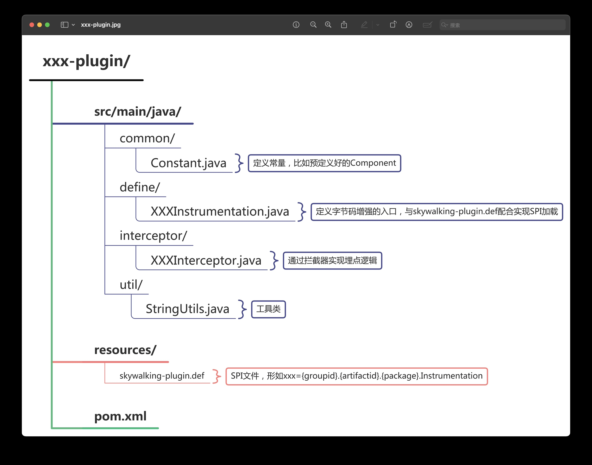
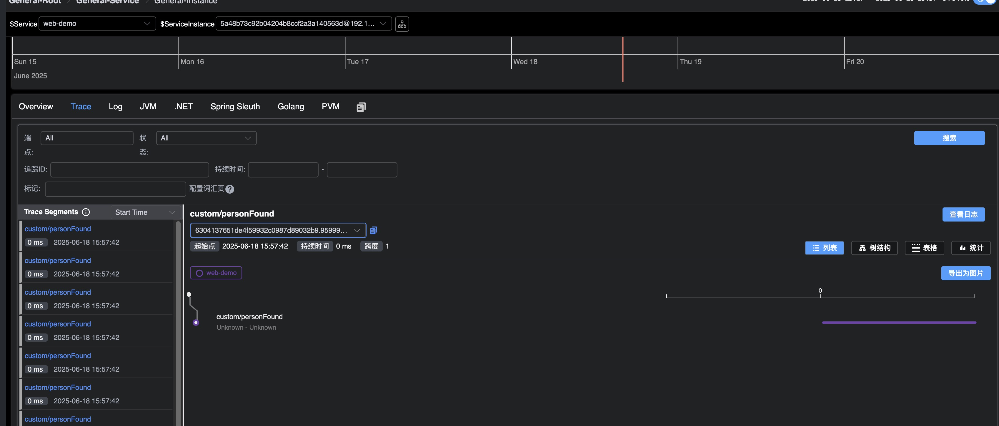

## 1. 理解SkyWalking Agent插件的运行机制

### 1.1. 插件加载流程​​

**加载顺序​**​

- ​​初始化配置​​：解析agent.config中的服务名、采样率等参数
- ​插件发现​​：扫描agent/plugins目录，按文件名顺序加载JAR（依赖插件需前置）
- ​生命周期管理​​：核心系统通过AgentClassLoader加载插件类，触发premain初始化
- ​字节码增强​​：使用Byte Buddy创建AgentBuilder，动态注入埋点逻辑

### 1.2. 插件生效原理​​

- 插桩阶段​​：在类加载时修改目标方法字节码，插入拦截器代码（如HTTP请求/SQL执行）
- 运行时拦截​​：方法执行前后触发拦截器，生成Span并记录耗时/异常
- ​上下文传播​​：通过ContextCarrier跨进程传递TraceID（如HTTP Header/Dubbo Attachment）

### 1.3. 插件文件组成

|文件类型|作用|示例|
|---|---|---|
|​拦截器类​​|实现埋点逻辑|CustomInterceptor.java|
|​插件定义文件​​|声明目标类与方法|skywalking-plugin.def|
|​依赖库​​|第三方组件支持|my-plugin-dependency.jar|

### 1.4. 两类核心指标​​

- Tracing（链路追踪）​​
  - ​Entry Span​​：服务入口（如HTTP Server），创建分布式调用链起点
  - Exit Span​​：服务出口（如DB调用/Kafka生产），标记远程调用终点
  - Local Span​​：内部方法（无远程交互），记录本地执行耗时

> ✅ ​​关键区别​​：Entry/Exit Span跨进程传播Context，Local Span仅线程内有效

- ​​Meter（指标统计）
  - 采集QPS、错误率、响应时分位值等时序指标
  - 通过MeterSystemAPI注册指标，支持Counter/Gauge/Histogram类型

### 1.5. 数据上报配置​​

```text
# agent.config
agent.service_name=your_service
collector.backend_service=192.168.0.1:11800  # gR协议上报地址[4,5](@ref)
plugin.custom.reporter=org.apache.skywalking.apm.reporter.kafka.KafkaReporter  # 自定义Reporter[6](@ref)
```

## 2. 手写插件实战

### 2.1. 创建项目结构



如图创建项目文件，注意pom文件中的配置。

> **敲黑板**
>
> 由于Agent涉及字节码编辑，非常容易出现版本冲突或者兼容性问题，skywalking采用shade插件重命名了依赖项的全限定名称。所以配置pom文件时一定要注意shade的设置。比如笔者遇到的通用配置,如果不设置shade更换包名，则会因为路径错误无法启动。报错如下，提示没有实现某个方法，隐蔽性非常高，很容易误导人。
>
> ```log
> 自定义skywalking的java agent的plugin时报错，错误对战如下所示：
> ERROR 2025-06-18 14:19:17.486 restartedMain SkyWalkingAgent : Enhance class xyz.firestige.demo.PersonEventSubscriber error. 
> java.lang.AbstractMethodError: Receiver class xyz.firestige.agent.CustomInstrumentation$1 does not define or inherit an implementation of the resolved method 'abstract org.apache.skywalking.apm.dependencies.net.bytebuddy.matcher.ElementMatcher getMethodsMatcher()' of interface org.apache.skywalking.apm.agent.core.plugin.interceptor.InstanceMethodsInterceptPoint.
> 	at org.apache.skywalking.apm.agent.core.plugin.interceptor.enhance.ClassEnhancePluginDefine.enhanceInstance(ClassEnhancePluginDefine.java:142)
> 	at org.apache.skywalking.apm.agent.core.plugin.AbstractClassEnhancePluginDefine.enhance(AbstractClassEnhancePluginDefine.java:119)
> 	at org.apache.skywalking.apm.agent.core.plugin.AbstractClassEnhancePluginDefine.define(AbstractClassEnhancePluginDefine.java:100)
> 	at org.apache.skywalking.apm.agent.SkyWalkingAgent$Transformer.transform(SkyWalkingAgent.java:193)
> ```
>
> ```xml
> <properties>
>   <shade.package>org.apache.skywalking.apm.dependencies</shade.package>
>   <shade.net.bytebuddy.source>net.bytebuddy</shade.net.bytebuddy.source>
>   <shade.net.bytebuddy.target>${shade.package}.${shade.net.bytebuddy.source}</shade.net.bytebuddy.target>
> </properties>
> <build>
>   <plugins>
>      <plugin>
>        <artifactId>maven-shade-plugin</artifactId>
>          <version>3.6.0</version>
>            <executions>
>              <execution>
>                  <phase>package</phase>
>                  <goals>
>                      <goal>shade</goal>
>                  </goals>
>                  <configuration>
>                      <shadedArtifactAttached>false</shadedArtifactAttached>
>                      <createDependencyReducedPom>true</createDependencyReducedPom>
>                      <createSourcesJar>true</createSourcesJar>
>                      <shadeSourcesContent>true</shadeSourcesContent>
>                      <relocations>
>                          <relocation>
>                              <pattern>${shade.net.bytebuddy.source}</pattern>
>                              <shadedPattern>${shade.net.bytebuddy.target}</shadedPattern>
>                          </relocation>
>                      </relocations>
>                  </configuration>
>              </execution>
>          </executions>
>      </plugin>
>   </plugins>
> </build>
> ```

### 2.2. 关键开发步骤

#### 2.2.1. 编写插桩定义

```java
import net.bytebuddy.description.method.MethodDescription;
import net.bytebuddy.matcher.ElementMatcher;
import org.apache.skywalking.apm.agent.core.plugin.interceptor.ConstructorInterceptPoint;
import org.apache.skywalking.apm.agent.core.plugin.interceptor.InstanceMethodsInterceptPoint;
import org.apache.skywalking.apm.agent.core.plugin.interceptor.enhance.ClassInstanceMethodsEnhancePluginDefine;
import org.apache.skywalking.apm.agent.core.plugin.match.ClassMatch;

import static net.bytebuddy.matcher.ElementMatchers.named;
import static org.apache.skywalking.apm.agent.core.plugin.match.NameMatch.byName;

public class CustomInstrumentation extends ClassInstanceMethodsEnhancePluginDefine {

    private static final String ENHANCE_CLASS = "xyz.firestige.demo.PersonEventSubscriber";
    private static final String INTERCEPTOR_METHOD = "personFoundEvent";
    private static final String INTERCEPTOR_CLASS = "xyz.firestige.agent.CustomInterceptor";

    @Override
    protected ClassMatch enhanceClass() {
        return byName(ENHANCE_CLASS);
    }

    @Override
    public ConstructorInterceptPoint[] getConstructorsInterceptPoints() {
        return new ConstructorInterceptPoint[0];
    }

    @Override
    public InstanceMethodsInterceptPoint[] getInstanceMethodsInterceptPoints() {
        return new InstanceMethodsInterceptPoint[] {
            new InstanceMethodsInterceptPoint() {
                @Override
                public ElementMatcher<MethodDescription> getMethodsMatcher() {
                    return named(INTERCEPTOR_METHOD);
                }

                @Override
                public String getMethodsInterceptor() {
                    return INTERCEPTOR_CLASS;
                }

                @Override
                public boolean isOverrideArgs() {
                    return false;
                }
            }
        };
    }
}
```

`ENHANCE_CLASS`是计划插桩的类，`INTERCEPTOR_METHOD`是打算拦截的方法。这里通过`named(INTERCEPTOR_METHOD)`生成匹配规则的时候支持定制更详细的匹配方案。比如`quartz-scheduler-2.x-plugin`就设计了多个过滤规则

```java
public class JobRunShellInterceptorInstrumentation extends ClassInstanceMethodsEnhancePluginDefine {

    public static final String CONSTRUCTOR_INTERCEPTOR_CLASS = "org.apache.skywalking.apm.plugin.quartz.JobRunShellConstructorInterceptor";
    public static final String JOB_EXECUTE_METHOD_INTERCEPTOR_CLASS = "org.apache.skywalking.apm.plugin.quartz.JobRunShellMethodInterceptor";
    public static final String JOB_EXECUTE_STATE_METHOD_INTERCEPTOR_CLASS = "org.apache.skywalking.apm.plugin.quartz.JobExecuteStateMethodInterceptor";
    public static final String ENHANC_CLASS = "org.quartz.core.JobRunShell";

    @Override
    protected ClassMatch enhanceClass() {
        return byName(ENHANC_CLASS);
    }

    @Override
    public ConstructorInterceptPoint[] getConstructorsInterceptPoints() {
        return new ConstructorInterceptPoint[] {
            new ConstructorInterceptPoint() {
                @Override
                public ElementMatcher<MethodDescription> getConstructorMatcher() {
                    return takesArguments(2)
                            .and(takesArgument(0, named("org.quartz.Scheduler")))
                            .and(takesArgument(1, named("org.quartz.spi.TriggerFiredBundle")));
                }

                @Override
                public String getConstructorInterceptor() {
                    return CONSTRUCTOR_INTERCEPTOR_CLASS;
                }
            }
        };
    }

    @Override
    public InstanceMethodsInterceptPoint[] getInstanceMethodsInterceptPoints() {
        return new InstanceMethodsInterceptPoint[] {
                new InstanceMethodsInterceptPoint() {
                    @Override
                    public ElementMatcher<MethodDescription> getMethodsMatcher() {
                        return named("run")
                                .and(isPublic())
                                .and(takesArguments(0));
                    }

                    @Override
                    public String getMethodsInterceptor() {
                        return JOB_EXECUTE_METHOD_INTERCEPTOR_CLASS;
                    }

                    @Override
                    public boolean isOverrideArgs() {
                        return false;
                    }
                },
                new InstanceMethodsInterceptPoint() {
                    @Override
                    public ElementMatcher<MethodDescription> getMethodsMatcher() {
                        return named("notifyJobListenersComplete")
                                .and(isPrivate())
                                .and(takesArguments(2))
                                .and(takesArgument(1, named("org.quartz.JobExecutionException")));
                    }

                    @Override
                    public String getMethodsInterceptor() {
                        return JOB_EXECUTE_STATE_METHOD_INTERCEPTOR_CLASS;
                    }

                    @Override
                    public boolean isOverrideArgs() {
                        return false;
                    }
                }
        };
    }
}

```

#### 2.2.2. 编写埋点逻辑

简单的埋点示例如下：

```java
public class CustomInterceptor implements InstanceMethodsAroundInterceptor {
    private static final StringTag PERSON_ID_TAG = new StringTag("id");

    @Override
    public void beforeMethod(EnhancedInstance enhancedInstance, Method method, Object[] allArguments, Class<?>[] argumentsTypes, MethodInterceptResult result) throws Throwable {
        AbstractSpan span = ContextManager.createLocalSpan("custom/personFound");
        span.setComponent(new OfficialComponent(8910, "CustomInstrumentation"));
        span.tag(PERSON_ID_TAG, allArguments[0].toString());
        span.start();

    }

    @Override
    public Object afterMethod(EnhancedInstance enhancedInstance, Method method, Object[] allArguments, Class<?>[] argumentsTypes, Object result) throws Throwable {
        ContextManager.stopSpan();
        return result;
    }

    @Override
    public void handleMethodException(EnhancedInstance enhancedInstance, Method method, Object[] allArguments, Class<?>[] argumentsTypes, Throwable throwable) {

    }
}
```

可以看到，实际上就是传统的面向切面编程。根据业务和打点的要求，做好埋点工作即可。如第一章节介绍，这里是收集数据的第一现场，可以通过span上传trace或者log信息，也可以通过meter上传metric信息。关于跨进程传递上下文，异步场景不断链等问题可以参考官方给webflux，mysql等中间件开发的agent，本文主要目标是引导大家入门，就不再赘述。

#### 2.2.3. 声明插件启用

在`resource`下创建skywalking-plugin.def文件，内容维持下面的格式

```text
{模组名}={插桩定义类的全限定名称}
custom-probe=xyz.firestige.agent.CustomInstrumentation
```

### 2.3. 构建部署与验证

#### 2.3.1. 构建与部署

参考前文提到的shade配置要点，执行mvn clean package命令打包后，将jar文件放入agent/plugin目录，agent在启动时会自动加载

### 2.4. 验证埋点

- 在应用的启动脚本上增加参数`-javaagent: /path/to/skywalking-agent.jar`
- 启动时观察日志，看到形如“INFO 2025-06-18 18:16:33.110 restartedMain AgentClassLoader : /Users/firestige/Projects/web-demo/skywalking-agent/plugins/apm-custom-probe-plugin-1.x.jar loaded. ”意味着加载成功
- 在UI上观察自定义的指标是否出现



## 3. 关键注意事项

### 3.1. 常见错误与解决方案​​

​|​问题场景​|​解决方案|
|---|---|​
|插件未加载|检查JAR文件名格式：插件名-版本.jar|
|方法未拦截|确认目标类/方法签名匹配（含包名），用named().and()细化匹配|x
|Span上下文丢失|跨线程调用需用ContextSnapshot手动传递|
|性能影响过大|避免高频方法埋点，采样率调低（agent.sample_rate=10）|

### 3.2. 易遗漏知识点​​

- ​​类加载隔离​​：插件需独立类加载器，避免依赖冲突（用\<scope>provided\</scope>）
- ​版本兼容性​​：Agent版本升级时需重测插件（核心API可能变更）
- ​ID生成规则​​：TraceID使用Snowflake算法，需确保WorkerID不冲突
- ​安全点暂停​​：避免在agentmain模式运行，防止JVM安全点延迟
- ​培训总结​​：开发插件需掌握​​字节码增强​​、​​上下文传播​​、​​SPI机制​​三大核心，通过严格匹配目标类、隔离依赖、性能调优规避常见问题。建议从简单插件（如拦截工具类）入手，逐步验证扩展。