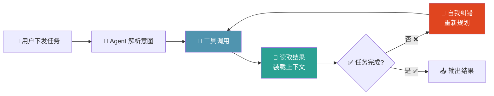
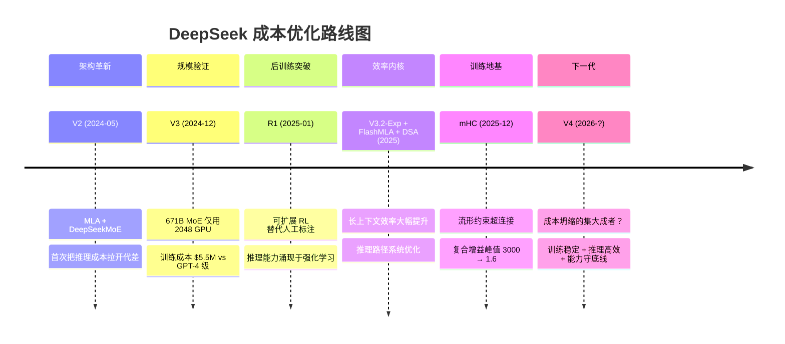
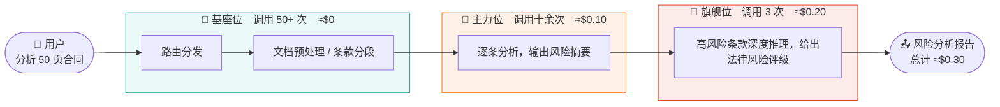

> 当 OpenClaw 吞噬着海量 token，当市场不断传出 DeepSeek V4 将成本再压数个台阶时，我们正在见证 LLM 从"军备竞赛"走向"生态分化"的转折点。[1][5][6]

---

## 一、引子：一个拼命降价，一个疯狂烧钱

时隔一年，DeepSeek 又闷声送上新的"新年大礼包"。尽管 V4 还没正式露面，各路自媒体已经开始百花齐放百家争鸣的架势，但这次争论的焦点不是跑分，而是价格。从年初 mHC 论文悄悄挂上 arXiv，到 FlashMLA 开源，再到 V3.2-Exp 放出实测，所有信号都指向同一个方向：他们不只是在做下一代模型，而是在系统性地把"单位能力成本"往下砸。如果这件事成了，下探的就不只是某一个 API 的价格，而是整条推理经济的成本门槛。[1][3][4][6]

> 图 1（DeepSeek 讨论度趋势）：基于 GDELT 全网新闻/媒体时间序列（过去 12 个月），可见讨论热度明显抬升。

与此同时，另一股力量正在疯狂吞噬 token：OpenClaw 以及一众 Agent 框架让"AI 当日常助手"从尝鲜变成常态。写代码、排日程、做调研、整理会议纪要、批量处理文档都能做，代价是一次任务动辄烧掉几十万甚至上百万 token。它不是在聊天，而是在把 token 当算力使用，反复调用工具、装载上下文、自我纠错，再来一轮。你盯着账单看的时候会发现，消耗量不是线性增长，而是会随任务复杂度快速爬升。

> 图 2（OpenClaw/Agent token 成本讨论趋势）：基于 GDELT 查询 `("OpenClaw" OR "AI Agent" OR "coding agent") AND (token OR "token cost" OR billing OR usage OR "context window")`，显示与 token 成本相关的讨论持续存在并阶段性升温。

一个拼了命降成本，一个疯了一样烧 token。巧合吗？还是说，这两股看似矛盾的趋势，其实正在合力把 LLM 行业推向一个全新的分岔口？这篇文章想聊的，就是这个分岔口背后的逻辑。

## 二、当下的现实：模型还在卷，账单先吃不消了

先看价格。截至 2026 年 3 月，旗舰模型的 API 定价仍然高悬：GPT-5.2 的混合价约 \$4.81/百万 token，Claude Opus 4.6 更夸张，达到 \$10.00/百万 token；而 DeepSeek V3.2，目前公认的"够用级"开源选手，只要 \$0.32/百万 token。换句话说，调一次 Opus 的钱，够你调 31 次 DeepSeek。[8][9][10]

> 数据来源：OpenAI API Pricing[8]、Claude Developer Platform[9]、DeepSeek API Docs[10]，取 3:1 输入输出混合价。

价格差了几十倍，能力差了多少？没有几十倍。Artificial Analysis 排行榜的 Intelligence Index 给出了一个直观的刻度：Opus 4.6 得分 53，GPT-5.2 得分 51，DeepSeek V3.2 得分 42。最强模型比"够用模型"高出大约 20–26%。确实更贵的模型更聪明，但远没有价格暗示的那么大。[11]

> 能力只高 20–26%，价格却高 15–31 倍。每一美元在 DeepSeek 上买到的"智力点"，是 GPT-5.2 的 12 倍，是 Opus 的 25 倍。[11]

这组数字指向一个残酷的结论：旗舰模型的"最后 20% 能力"，正在以极其陡峭的价格曲线被定价。从 GPT-4 到 GPT-5.2，用户的真实体感是"好像聪明了一点"，但账单的体感是"确实贵了不少"。边际收益递减不是抽象概念，是每个月末结算日都能量化的现实。对于一次性问答场景，多花钱买旗舰也许还能忍；但当使用模式切换到 Agent，一次任务几十轮调用、几十万 token，这 15 到 31 倍的价差就不再是"体验溢价"，而是"商业模式能不能跑通"的硬约束。市场真正的痛点，早已不是"不够聪明"，而是"用不起"和"不够快"。

## 三、OpenClaw 现象：Agent 时代的 Token 黑洞

OpenClaw 向世人证明了一件事：LLM 可以当通用任务助手来用，不是一问一答那种，而是给它一个目标，它会自己把任务拆开，查代码库、搜文档、调工具、处理报错、纠正自己，一路推进到你要的结果，全程不需要你手把手盯着。这把 LLM 的适用范围彻底重新定义了。过去你问它"帮我解释这段报错"，它只是个聪明的搜索替代品；现在你说"帮我把这个 Express 后端从 JavaScript 迁移到 TypeScript"，或者"帮我调研这个行业的竞品格局"，或者"把这 20 份会议纪要整理成周报"，它会真的去做完。编码、调研、数据汇总、日程安排、资料整理，凡是能被拆解成"一步一步去执行"的任务，都可以交给 Agent。

代价是什么？token 消耗。就拿代码迁移来说：你以为它会像高级工程师那样先通读全局再动手。它确实先通读了，但"通读"对 Agent 来说意味着把整个目录树和关键文件的内容塞进上下文窗口，这一步就烧掉了好几万 token。然后它开始逐文件改写：改完一个文件，调一次 `tsc` 编译，报错了，把报错信息回收进上下文，重新推理，再改，再编译……一个中等规模的迁移任务，这个循环可能转 30 到 50 圈。你盯着 token 用量看，会发现它不是在"对话"，而是在用 token 当算力。

这就是 Agent 工作流和传统聊天场景的本质区别。普通对话是"一问一答"：你发一句话，模型回一段，来回几轮就结束了。Agent 是"自主循环"：解析意图 → 工具调用 → 回收结果 → 装载上下文 → 推理决策 → 再次调用工具，直到任务完成或触达重试上限。每一轮循环都有四个吃 token 的环节：

1. **上下文装载**：把文件内容、工具输出、历史操作记录塞进 prompt；
2. **推理决策**：模型输出下一步该做什么（这部分生成 token 特别贵，因为是输出侧）；
3. **工具调用**：读文件、写文件、跑命令、搜索代码库；
4. **自我纠错**：如果上一步出错，回溯上下文重新规划，然后再跑一遍。

> 每一次循环都在消耗 token，复杂任务可能循环数十次。

为了让你直观感受 Agent 的"胃口"有多大，把三种典型使用模式的 token 消耗放在一起看：

> 普通聊天一轮大约消耗 1K token，RAG 问答一次约 5–10K，而一次 Agent 编码任务轻松吃掉 30 万到 100 万 token。Agent 的消耗是聊天的**几百倍**。

数字都在这里了，来算笔账。假设一个知识工作者每天用 Agent 处理 30 个子任务：写代码、整理文档、做调研、分析数据都算在内，每次平均消耗 50 万 token（这在 OpenClaw 的实际使用中属于中等偏保守的估计），月均按 22 个工作日计算：

| 模型 | 混合价（$/百万 token） | 单次成本 | 日均 30 次 | **月成本（22 天）** |
|:---|:---:|:---:|:---:|:---:|
| Claude Opus 4.6 | $10.00 | $5.00 | $150.0 | **$3,300** |
| GPT-5.2 | $4.81 | $2.41 | $72.3 | **$1,588** |
| DeepSeek V3.2 | $0.32 | $0.16 | $4.8 | **$106** |

一个人，一个月，Opus 账单 \$3,300，DeepSeek 账单 \$106。差了 31 倍和第二节推导出的单价差一模一样，但乘上 Agent 的调用频次之后，这不再是"每次多花几美分"的体感问题，而是"一个 10 人团队每月多烧 \$32,000"的经营决策。用旗舰模型跑 Agent，不是贵不贵的问题，是商业模式能不能算过账来的问题。更致命的是，这还只是当前的消耗水平。随着 Agent 能力边界扩展：从单文件编辑到跨仓库重构，从简单问答到端到端的调研报告生成，单次任务的 token 消耗还会继续上爬。第二节提到的"边际收益递减"在 Agent 场景下被成倍放大：能力每高一档，成本涨十几倍；而调用次数从一次变成几十次，总成本又涨几十倍。两个乘数叠在一起，旗舰模型的价格曲线就从"陡峭"变成了"悬崖"。所以结论不是"旗舰模型不好"，它们的确更强、更准、幻觉更少。结论是：Agent 场景天然会把需求引力拉向"便宜且够用"的模型，而非"最贵最强"的模型。这不是消费降级，而是使用模式的结构性转变。当你的模型不是被调用 1 次而是 100 次，成本敏感度就从加法变成了乘法。在那个乘法世界里，每一美元的单价差距都会被放大到令人窒息的比例。而这，正是 DeepSeek V4 的故事变得重要的原因。

## 四、DeepSeek V4 的启示：成本坍缩才是真正的范式转移

账已经算的很清楚了：Agent 工作流把单次任务的 token 消耗推到高位，模型能力再强，单位能力成本下不来，规模化就会在商业上先撞墙。所以 V4 的故事，重点从来不是下一代能力有多强，而是它有没有把训练和推理成本继续往下压。[6]

先看路线图。DeepSeek 从 V2 到 V4，每一代都在围绕"单位能力成本"做系统优化。这不是一次性的工程偶然，而是一条连续迭代、方向高度一致的技术路线：

这件事并非只有传闻。第一层也是最硬的证据，来自跨年发布的 mHC 论文（arXiv:2512.24880）。这篇论文并不以"V4 技术报告"命名，但它直指超大规模训练的核心痛点：HC 在深层复合映射下会出现严重的传播不稳定，文中给出的复合增益峰值接近 3000；而在 mHC 约束下，最大偏离被压到约 1.6。它解决的不是"跑分小优化"，而是"模型能否稳定训练到更大规模"的地基问题。只要地基更稳，训练回滚、无效算力和调参成本都会下降，这正是成本坍缩能发生的前提条件。[1] 要理解 mHC 在做什么，先看残差连接的演进。标准残差连接（ResNet 以来的默认范式）只有一条通路；HC 把残差流扩展到多条流并引入可学习映射，增加了拓扑复杂度，但代价是丧失了恒等映射性质；mHC 则在 HC 的基础上，用 Sinkhorn-Knopp 算法把残差映射投影到双随机矩阵流形上，恢复了恒等映射的稳定性：

> **图源**：mHC 论文 Figure 1[1]。(a) 标准残差连接；(b) HC：扩展残差流宽度，引入可学习映射 $\mathcal{H}^{res}$、$\mathcal{H}^{pre}$、$\mathcal{H}^{post}$；(c) mHC：将 $\mathcal{H}^{res}$ 约束到 Birkhoff 多面体（双随机矩阵流形），恢复信号守恒。

这个约束为什么重要？因为 HC 的残差映射 $\mathcal{H}^{res}$ 是无约束的，当它跨层复合时（即 $\prod_{i=1}^{L-l}\mathcal{H}^{res}_{L-i}$），信号增益会失控。下图是 27B 模型实测数据：

> **图源**：mHC 论文 Figure 3[1]。(a) 单层映射的增益幅度；(b) 复合映射的增益幅度。注意 Y 轴刻度：HC 的复合增益峰值接近 **3000**，意味着信号在深层传播中可能被放大 3000 倍，这是训练崩溃的直接原因。

而在 mHC 约束下，同样的度量变成了什么样？

> **图源**：mHC 论文 Figure 7[1]。同样的 27B 模型，mHC 的复合映射增益最大值仅约 **1.6**，相比 HC 的 3000，降低了三个数量级。这不是"优化了一点"，而是彻底解决了训练稳定性问题。

**3000 → 1.6**，三个数量级的压缩。翻译成工程语言就是：训练更少崩溃、更少回滚、更少浪费在"调不稳"上的算力，每一项都是真金白银的成本。mHC 在 27B 模型上的额外时间开销仅 6.7%（$n=4$），换来的是训练稳定性从"可能在 12k 步爆掉"变成"全程平稳"。

第二层证据来自方法论的连续性。R1 的演进方向把后训练从“重人工推理标注”往“可扩展 RL”迁移，V3.2-Exp 与配套内核（DSA、FlashMLA）又把效率优化进一步推到长上下文和推理路径上，并强调在能力基本持平前提下换取更优的训练/推理效率。这意味着 DeepSeek 的路线不是一次性的工程偶然，而是连续数代都在围绕“单位能力成本”做系统优化：先稳训练，再提效率，再把效率落到真实推理场景。[2][3][4]

第三层才是市场最爱讨论、但证据强度最低的部分：泄露配置、泄露 benchmark、社区反编译分析。你给出的时间线（1 月代码泄露、2 月 benchmark 外流）与很多二手信源基本一致，它们对“V4 可能走极致成本优化并维持高能力”这个判断形成了方向性支持，但这类材料在写作上必须明确标注为“非官方信息”，不能与论文证据同权重混写。特别是 Engram 细节、Model1 代号、SWE-bench 高分这类点位，更适合写成“市场信号”，而不是“已被官方证实的技术事实”。[6]

因此，更专业也更有说服力的观点是：尽管截至 2026 年 3 月 5 日，V4 的完整技术报告仍未公开，但"公开论文 + 官方仓库效率路线 + 泄露侧信号"三者已经形成同向指向DeepSeek 的下一代模型大概率继续押注"极致优化训练与推理成本，同时守住高能力下限"。这不是拍脑袋的乐观，而是基于证据分层后的合理推论。[5][6]

## 五、核心观点：LLM 的生态位理论

旗舰模型越卷，价格越高。DeepSeek 却像个离经叛道者，一代接一代地往下压成本，没有停止的迹象。两件事同时发生，"谁跑分最高谁赢"这套叙事解释不了。

OpenClaw 的出现，让这个矛盾有了答案。Agent 工作流一旦铺开，高分模型的优势会被成本乘数整个吃掉。它打开的不是一场更激烈的军备竞赛，而是一个全然不同的赛道。在那个赛道上，贵是包袱，不是实力。

我们需要一个更好的框架。生态学的**生态位理论**（Hutchinson, 1957）给了一个答案：物种不是在同一条跑道上比赛，而是在不同的成本-能力区间里竞争，谁能以最低的代价填满那个位置，谁就赢了那个层级。自然界里生物量最大的不是狮子，是蚂蚁和浮游生物；决定生态系统繁荣程度的也不是顶层物种有多强，而是每个层级能养活多少物种、服务多少需求。

这个分层用一张图就能说清楚。生态学的营养级金字塔（Eltonian Pyramid）：越往上，个体能力越强但数量越稀少、成本越高；越往下，单体越弱小但总数量越庞大、成本越低。LLM 市场的成本和调用量分布，和这个结构完全对应：

> 左：自然生态营养级，顶级捕食者数量极少但单体最强，中低层物种数量庞大且撑起了生态系统的总体量。右：LLM 市场生态位，旗舰位调用占比约 5%，主力位约 35%，基座位约 60%。关键洞察：决定生态系统繁荣程度的不是顶层有多强，而是中低层能覆盖多少需求。LLM 市场同理：市场规模的天花板是成本，不是能力。只有足够多的任务能被"刚好够用的模型"以可承受的价格处理，这个市场才真正大起来。

### 1. 旗舰位（Apex Predator）

第二节的数据已经给出了定位的经济学解释："最后 20% 能力"需要 15–31 倍的溢价。这个陡峭的定价曲线天然把旗舰限定在低频高价值场景：科研辅助中"一次推理错不起"的决策，数百页合同里那几条决定胜败的条款，复杂多步数学证明的最后验证环节。你不会让 Opus 帮你跑 30 轮 Agent 循环，太贵了；但你会在 Agent 拿不准的时候，把最难的那一步交给它。

**旗舰位的价值不是被高频调用，而是在少数高杠杆节点上确保质量上限。**

### 2. 主力位（Keystone Species）

第三节的算术已经说明了为什么：一个开发者用 Agent 跑一个月，Opus 账单 \$3,300，DeepSeek \$106，差了 31 倍。当使用模式从"偶尔问一句"变成"Agent 一天调几百次"，**经济引力会把绝大多数调用拉到主力位上**。日常编程辅助、文档批量处理、企业客服对话、数据清洗，这些占据 80% 工作量的任务，不需要最强的模型，需要的是够好、够快、够便宜、输出够稳定的模型。

这也是第四节 DeepSeek V4 叙事的落点。V4 瞄准的不是某个榜单第一，而是整个生态里最厚、最稳定、最可持续的需求层。谁占住了主力位，谁就拿到了 Agent 时代最大的市场体量。

**主力位是经济引力的落点。大多数任务不需要最强的模型，只需要够用、够快、够便宜的模型，这正是主力位存在的理由，也是这个层级天然会吸走最大市场体量的原因。**

### 3. 基座位（Decomposer）

基座模型就是 LLM 系统的"毛细血管"。它们做的事单独看毫不性感：判断用户意图该交给哪个模型（路由分发）、把非结构化文本转成 JSON（格式转换）、给内容打标签分类、过滤敏感词。每一个调用消耗几百 token，花费接近零，但在一个成熟的 Agent 系统里，这类调用的频次可能占到 60% 以上。它们是胶水，把旗舰和主力粘合成一个可运行的整体。

各类 7B/14B 的开源模型、端侧部署的小模型、针对特定任务微调过的专用模型，都坐在这个位上。它们不需要上排行榜，只需要"快、稳、便宜、好部署"。

**基座位被调用的频次最高，但单次价值最低，拿掉它们，整个 Agent 系统就堵住了。**

### 4. 按需调用：任务决定层级，成本自然贴地

理解了三个生态位，下一个问题就变成了：谁来调度它们？答案是 Agent 框架。一个成熟的 Agent 工作流不是只调一个模型，它会根据子任务的复杂度，动态选择不同层级的模型。用一个具体场景来演示。假设你让 Agent 分析一份 50 页的商业合同：

这一次任务调了多少次模型？基座模型被调了 50+ 次（路由 + 预处理），主力模型被调了十几次（逐条分析），旗舰模型只被调了 3 次（关键条款把关）。总成本大约 \$0.30，如果全程用旗舰，同样的任务大概要花 \$5.00。成本只有 1/16，但质量差距可能不到 5%，因为旗舰的"深度推理"能力只被用在了真正需要它的 3 个节点上。

这就是"按需调用"的力量：不是找一个最好的模型包打天下，而是给每个子任务找那个"刚好够用的模型"，能力不到才升层，够用的地方绝不多花一分钱。这不是妥协，而是把成本压到任务真正需要的水位。

### 为什么是三层而不是一层？

最直觉的反对意见："如果旗舰模型也便宜了呢？那不就一层通吃了？"答案藏在成本结构里。训练前沿模型的算力需求是超线性增长的：当旗舰从 \$10/M 降到 \$1/M 的时候，主力可能已经从 \$0.32 降到 \$0.03，基座可能从 \$0.01 降到接近零。所有层级都在变便宜，但层级之间的相对差距是结构性的，因为前沿探索的边际成本永远高于在已有路径上做效率优化。价差不会消失，只会整体下移。多生态位不是过渡态，而是成熟市场的稳态。

## 六、趋势预测：哪些方向的 LLM 会大放光彩？

如果我们的生态位框架成立，那么接下来的问题就不再是"哪个模型会赢"，而是"哪些方向的模型会把各自的生态位撑得更厚"。答案不止一个，正如成熟的自然生态系统不会只进化出一种物种，LLM 市场也会同时催生多个高价值赛道。以下五个方向，是我们认为未来 2–3 年内最值得关注的演化分支。

### 6.1 「Token 经济型」模型——Agent 时代的刚需

第三节算过那笔账：Agent 把单次任务的 token 消耗推到 30–100 万量级，旗舰模型的价格曲线在那个乘法世界里直接变成悬崖。这个现实催生了一条明确的赛道：模型的核心竞争力从"跑分最高"变成了"每美元能买到多少可用智力"。Token 经济型模型不追求在所有 benchmark 上登顶，而是在"够用"的能力基线上，把单位 token 成本压到极致、把并发吞吐拉到最高、把输出稳定性做到可预测。DeepSeek V4 如果沿着第四节描述的路线兑现：稳训练（mHC）+ 高效推理（FlashMLA/DSA）+ 守住能力下限，它大概率会成为这个赛道的标杆。但这条赛道上远不止 DeepSeek 一个选手。下图把 2025 年初（约 7 款）和 2026 年 3 月（22 款）定价 ≤\$1.2/M 的模型全部放在同一个坐标系里：

> 散点：横轴 = Intelligence Index，纵轴 = 混合价；透明气泡 = 2025 年，实色气泡 = 2026 年；蓝色 = 美国，红色 = 中国，绿色 = 欧洲/其他。环形图：内圈 = 2025 价格分布（7 款），外圈 = 2026 价格分布（22 款）。数据来源：Artificial Analysis LLM Leaderboard, 2026-03-04，取 3:1 混合价。

三个值得注意的信号：

1. **玩家数量翻了三倍。** 一年前价格带内的选手只有 7 款，分属 4 家组织；如今扩张到 22 款、涵盖至少 14 家，且 $0.20–$0.50 的"中低价密集区"从 3 款膨胀到 8 款——这段价区正在成为主战场。
2. **美国头部厂商全部入场。** OpenAI（gpt-oss 系列、GPT-5 mini）、Google（Gemini 3 Flash）、xAI（Grok 4.1 Fast）、NVIDIA、Amazon 悉数出现。Token 经济型不再是中国厂商的"低端内卷"，而是全球共识性赛道。
3. **底价还在下探。** Gemma 3n E4B 做到 \$0.03/M，Liquid LFM2 24B 做到 \$0.05/M。能力基线仍偏低（idx 7–8），但方向指向一个清晰的物理极限：当推理成本接近电费本身，模型将变成基础设施而非产品。

**预测**：未来 12 个月内，主流 Agent 框架会内置"模型路由"功能，按子任务复杂度动态选择模型层级。这不是可选优化，而是刚需：没有路由，Agent 的商业模型就跑不通。

### 6.2 「领域专精」模型——垂直场景的效率之王

通用模型是全科医生，领域专精模型是心外科专家。在第五节的生态位框架里，这类模型横跨主力位和基座位，不一定最大，但在自己的领域里，能用更小的参数量、更低的推理成本，达到甚至超越通用旗舰的表现。路线已经成熟：用旗舰模型的输出做蒸馏数据，喂给 7B–70B 的小模型做领域微调。代码模型（Codex 系列）、医疗模型、法律模型、金融分析模型……每一个垂直行业的"最后一公里"都不一样，通用模型的边际收益在垂直场景里衰减得更快。仅以代码场景为例，排行榜上已经能看到明确的"专精化"趋势：快手的 KAT-Coder-Pro V1（\$0.53/M, idx 36）、字节的 Doubao Seed Code（免费, idx 34）、Alibaba 的 Qwen3 Coder 系列（30B–480B 多档位）、Mistral 的 Devstral 2……它们不跟通用旗舰拼综合跑分，只在代码任务上做到"同等或更高质量、1/5 的价格"。可以预见，法律、金融、医疗等行业也会复刻同样的路径。

**预测**：每个年营收超过 10 亿美元的行业，最终都会跑出自己的"行业模型"。它们不会出现在 MMLU 排行榜上，但会出现在那个行业的生产系统里。

### 6.3 「端侧推理」模型——隐私与延迟的终极解法

云端模型有两个永远无法完全解决的问题：网络延迟和数据出域。端侧模型（跑在手机、PC、IoT 设备上的小模型）是对这两个问题的物理层回答。Apple Intelligence 已经验证了这条路线的商业可行性。更关键的是，端侧模型天然属于基座位，处理的是"快速响应、低复杂度、高频次"的任务：语音助手的意图识别、输入法的实时补全、本地文档的即时摘要。这些场景根本不需要也等不及云端的旗舰模型来响应。这个赛道的参与者比想象中多得多：Google Gemma 3n（E2B/E4B）、Microsoft Phi-4 Mini、小米 MiMo-V2-Flash、NVIDIA Nemotron Nano 9B/12B、Mistral Ministral 3B/8B、IBM Granite 4.0 350M/1B……几乎所有头部厂商都在做"能跑在消费级硬件上的模型"。当一个赛道吸引了 Google、Microsoft、NVIDIA 和小米同时押注，"端侧 AI"就不再是概念，而是下一个基础设施级的市场。

**预测**：端云协同将成为标配架构。端侧负责 <100ms 的即时响应和隐私敏感任务，云端负责需要深度推理的重型任务。两者之间的调度逻辑，本质上就是第五节"三层编排"在终端设备上的投射。

### 6.4 「长上下文低成本」模型——RAG 的终结者？

RAG（检索增强生成）之所以流行，是因为上下文窗口太短或太贵，你不得不先用检索把相关片段捞出来，再塞进有限的窗口。但如果上下文窗口足够大（百万级 token）且足够便宜呢？DeepSeek 的 DSA（DeepSeek Sparse Attention）和 V3.2-Exp 正是在这个方向上发力，专注于长上下文场景下的效率优化。当"把整本书扔进去直接问"比"先建索引再检索再拼接"更便宜、更准确的时候，RAG 的很大一部分应用场景会被直接取代。当前排行榜的上下文窗口格局已经分化得很明显：Meta Llama 4 Scout 做到了 10M token，xAI Grok 4.1 Fast 达到 2M，Google Gemini 全系列和 Qwen3.5-Flash 稳定在 1M，Amazon Nova 系列也是 1M。更关键的是价格：Gemini 3.1 Flash-Lite 以 \$0.56/M 的价格提供 1M 上下文，Qwen3.5-Flash 更是 \$0.10 输入 + \$0.40 输出。百万级窗口正快速从"旗舰专属功能"变成"经济型标配"。

**预测**：百万级上下文 + 极低单价的组合，会在未来两年内颠覆现有的知识检索范式。RAG 不会消失，在超大规模知识库场景下仍然有不可替代性，但适用边界会大幅收窄。

### 6.5 「推理蒸馏」模型——把思考能力压缩到小身躯

o1 和 R1 证明了一件事：让模型"先想清楚再回答"能显著提升复杂推理表现。但推理模式有个致命问题：思考过程本身消耗大量 token，而这些 token 都按输出价格计费。一次深度推理可能生成几千个"思考 token"，成本直接翻倍。这就引出了一个自然的追问：能否把旗舰模型的推理能力蒸馏到更小、更便宜的模型里？让一个 14B 的模型也学会"停下来想一想"，但推理成本只有旗舰的 1/10？R1 的开源蒸馏版本已经证明了这条路的初步可行性。排行榜上的证据越来越密集：DeepSeek R1 Distill Llama 70B（\$0.88/M, idx 16）、R1 0528 Qwen3 8B、小米 MiMo-V2-Flash（\$0.15/M, idx 41，本身就是一个内置推理能力的小模型）、Allen Institute 的 Olmo 3 7B Think（\$0.14/M, idx 17）……"让小模型学会思考"已经不再是实验室论文，而是一条有产品、有定价、有用户的赛道。在第五节的生态位框架里，推理蒸馏模型是主力位的一个重要进化方向：不提升参数规模，而是提升"每个参数的推理深度"。

**预测**：下一代性价比之王很可能是"会思考的小模型"。它不需要 600B 参数，不需要 MoE 架构，但它能在数学、代码、逻辑推理等任务上逼近旗舰水平，因为它学会了旗舰的思考方式，只是用更小的身躯去执行。

---

这五个方向并不互斥，它们是同一个生态位框架下的不同演化分支。Token 经济型和推理蒸馏主要充实主力位，领域专精和端侧推理主要充实基座位，长上下文低成本则可能同时影响主力位和基座位。它们共同的指向是：LLM 的竞争正在从"单一维度的能力比赛"转向"多维度的生态位填充"。谁能在自己的生态位上做到极致，谁就能在这个市场里活得最好。

## 七、验证：三层分化已经发生了吗？

生态位理论的核心预测是：LLM 市场不会收敛到一个赢家，而是分化出若干个经济特征截然不同的层级，各层级在调用频次、单次价格和总花费上，走向不同的极点。如果分化确实在发生，我们应该能在市场数据里看到三组同向的证据。下图先给出整体结构，随后逐组说明。

> 蓝色 = 模型数量（金字塔：基座 80%），橙色 = 调用量（金字塔：基座 60%），绿色 = 总花费（**菱形：主力 55%**）。前两条系列同向递增，绿色系列反向鼓出——主力层以不足 20% 的模型数量和 35% 的调用量，吃走了整体花费的 55%。这个「菱形」正是生态位分化已经发生的核心证据。

**第一组：模型数量。** 定价 ≤\$1.2/M 的"主力+基座"价位，一年内从 7 款扩张到 22 款；而旗舰价位（>\$4/M）始终只有寥寥几款。数量本身已经在分层。

**第二组：调用量分布。** 在成熟的 Agent 工作流里，实际调用占比约为：基座位 60%、主力位 35%、旗舰位 5%。调用量越往下越密集，正是成本压力在起作用：能用便宜模型完成的，没有理由升层。

**第三组：总花费分布，也是最有说服力的一组。** 如果市场遵循"能力越强越赚钱"的逻辑，旗舰应该收走最大份额；但实测数据指向相反的结构：总花费分布更接近中间鼓起的菱形，主力层承接了大部分市场金额。原因很直接：旗舰调用频次太低，基座单价太低，只有主力层同时具备足够高的频次和足够高的单价，能积累出最大的总量。

这也解释了为什么 V4 的叙事天然会落在主力位。只要 V4 继续沿着“稳训练 + 低推理成本 + 高可用能力”这条路走，它争夺的就不是某个榜单第一，而是整个生态里最厚、最稳定、最可持续的需求层。这个层级一旦被占住，上层的品牌价值和下层的分发控制力都会跟着被放大。从动态角度看，未来几年这三组数据还会继续错位演化：如果 Agent 继续爆发，主力层的调用量份额会更胖；如果推理成本进一步下降，基座的数量还会继续膨胀；如果前沿能力仍然稀缺，旗舰会继续维持小体量高溢价。三者不会合并成一条直线，而是长期保持张力，这正是成熟生态的常态。

综合来看，验证的结论是：多生态位已经长期共存，且结构越来越稳定。LLM 产业不是单峰竞速，而是分层协作。越是 Agent 化、产品化、规模化，这种分层就越明显。

## 八、反思：生态位理论的局限性

生态位框架把 LLM 市场讲成了一个"分层共存"的故事。这很优雅，但优雅的模型往往有隐含假设。现在该诚实地拆解这些假设了：这个框架在什么情况下可能失效？

### 8.1 如果旗舰也变得很便宜呢？

这是对生态位理论最直接的一记重拳。第五节说"价差是结构性的"，但这基于一个前提：前沿探索的边际成本永远高于在已有路径上做效率优化。万一出现一次"Transformer 时刻"级别的架构跃迁（比如某种全新的计算范式让顶级推理能力的成本一夜之间归零），三层生态位不就塌缩成一层了吗？理论上，这是成立的。但历史证据指向另一个方向：每一次"成本坍缩"，最终都扩大了用量而非消灭了层级。这正是 Jevons 悖论的 AI 版本：蒸汽机效率提升没有减少煤炭消费，反而让煤炭用量暴增。GPU → TPU → 专用推理芯片的演进路径也遵循同样的规律：推理变便宜了，但 Agent 的调用量也跟着爆炸了，净效果是需求曲线外移，而非层级合并。更关键的一点：即使今天的旗舰降到了今天主力的价格，新的旗舰会在更高的能力边界上被定义出来。"最贵"是一个相对位置，不是绝对价格。2024 年的旗舰是 GPT-4（\$30/M），2026 年的旗舰是 Opus 4.6（\$10/M），价格降了 3 倍，但"旗舰位"这个生态位依然存在，只是往上挪了一格。

**结论：生态位不会消失，但生态位的边界会移动。** 框架本身是对的，但你不能把今天的边界固化成永恒的地图。

### 8.2 如果赢家通吃呢？——平台锁定 vs 开源制衡

生态位理论的第二个隐含假设是自由竞争。但如果某个厂商通过 API 生态、数据飞轮、分发渠道建立了强平台锁定呢？OpenAI 的 GPT 系列 + ChatGPT 10 亿月活 + Codex 开发工具链已经有这个苗头：当你的用户、数据和工作流全都绑在一个平台上，"换一个更便宜的模型"的迁移成本可能高到不值得。互联网历史提供了两个重要反例：Linux 没有被 Windows 消灭，Android 没有被 iOS 消灭。两次破局的关键变量都是开源。2026 年的 LLM 市场有一个非常特殊的结构性条件：DeepSeek R1 采用 MIT 许可证、Mistral Small 系列采用 Apache 2.0，属于 OSI 认可的真正开源；Meta Llama 4 和 Qwen 主力版本则采用各自定制的许可证（月活或商业规模超过阈值须另行申请授权），权重可免费获取但并非标准开源。即便如此，"开放权重"已经成为头部玩家的默认选项而非弱者的求生策略。这意味着技术层面的封闭垄断几乎不可能：你一发新论文，三个月内就有可用的公开复现。但也要诚实地承认：开源能制衡"技术垄断"，不能制衡"分发垄断"。Apple 控制端侧分发（Apple Intelligence 只能用 Apple 选定的模型）、Google 控制搜索入口（Gemini 嵌入每一个 Google 产品）、Microsoft 控制开发者工具链（Copilot 绑定 VS Code + GitHub），这些不是模型能力的竞争，而是管道控制权的竞争。

**结论：技术层不会通吃，但分发层可能。真正的风险不在模型，在管道。**

### 8.3 如果规则改变了呢？——非技术因素的生态位

之前的分析全部基于"技术 + 经济"维度，但现实世界里还有一种力量能强行划分生态位：政策。EU AI Act 的合规要求正在人为制造"欧盟可用模型"这个子生态位，不是因为技术上需要一个专门的欧盟模型，而是因为不满足透明性、可解释性、数据驻留要求的模型根本不允许在欧盟市场上线。中美芯片管制让"能在国产芯片上跑的模型"成为刚需而非可选项，这直接解释了为什么华为昇腾适配、国产 GPU 推理优化在中国市场是一条独立的赛道。数据主权法规（GDPR、中国《数据安全法》、印度 DPDPA）则在物理层面切割了"数据可以去哪里"的边界。这些不是"自然演化的生态位"，而是"人造隔离墙"。它们不遵循效率逻辑：一个合规但能力稍弱的模型会在特定市场里击败一个更强但不合规的模型。生态位理论能解释"为什么市场会分层"，但不能解释"为什么某些层级的边界长这样"。

**结论：现实市场 = 技术生态位 × 政策生态位。** 本文的框架覆盖了前者，但对后者的解释力有限。

---

三记重拳打完，该给框架一个公允的评价了：生态位模型是一个"60 分的模型"，它能解释大部分技术驱动的市场现象（成本分层、Agent 编排、多模型共存），但对架构跃迁、平台锁定和政策壁垒这三类"外部冲击"的解释力不足。在它失效的地方，往往是最值得警惕的地方。

## 九、结语：分化，是成熟市场的答案

回头看这整个故事：DeepSeek 推低了成本地板，OpenClaw 推高了用量天花板。这两股力量不是对立的，是同一枚硬币的两面，共同逼迫市场走向分化。当一次 Agent 任务要烧掉 50 万个 token，你不可能全程开着 \$10/M 的旗舰模型；当垂直场景需要的是"足够好且足够快"，你也不需要一个 600B 参数的全能选手。分化不是退化，而是成熟。LLM 产业的终局不是单峰竞速，而是三层生态位长期共存——Agent 框架把每一次调用路由到刚好够用的那一层，成本自然贴地。生态位从来不是妥协出来的，而是成本压力筛选出来的。旗舰的稀缺性支撑溢价，主力的高频高单价积累出最大的总花费，基座的低成本高频次让整个 Agent 系统转得起来。三层缺一不可，缺了哪一层，要么系统跑不起来，要么钱烧在了不该烧的地方。

最后一个问题留给你：如果你的系统架构里只有一个 `model_id`，那说明你还没有进入 Agent 时代。下一次设计系统的时候，先问一句：这个子任务，实际需要多少智力？答案往往比你预设的便宜得多。

## 参考文献

1. Xie Z, Wei Y, Cao H, et al. [mHC: Manifold-Constrained Hyper-Connections](https://arxiv.org/abs/2512.24880). arXiv:2512.24880, 2025.
2. DeepSeek-AI, Guo D, Yang D, et al. [DeepSeek-R1: Incentivizing Reasoning Capability in LLMs via Reinforcement Learning](https://arxiv.org/abs/2501.12948). arXiv:2501.12948, 2025.
3. DeepSeek-AI. [DeepSeek-V3.2-Exp: Boosting Long-Context Efficiency with DeepSeek Sparse Attention](https://github.com/deepseek-ai/DeepSeek-V3.2-Exp). GitHub, 2025.
4. DeepSeek-AI. [FlashMLA: Efficient Multi-head Latent Attention Kernels](https://github.com/deepseek-ai/FlashMLA). GitHub, 2025.
5. arXiv. [DeepSeek-AI 作者检索页](https://arxiv.org/search/?searchtype=author&query=DeepSeek-AI). arXiv, 2026-03-04.
6. 作者整理. DeepSeek V4 非官方信号汇编（含泄露配置、基准测试与社区拆解）. 未刊稿, 2026-03-04.
7. Guo D, Yang D, Zhang H, et al. [DeepSeek-R1: Incentivizing Reasoning Capability in LLMs via Reinforcement Learning](https://doi.org/10.1038/s41586-025-09422-z). *Nature*, 2025, 645: 633–8.
8. OpenAI. [API Pricing](https://openai.com/api/pricing/). OpenAI, 2026.
9. Anthropic. [Build on the Claude Developer Platform](https://claude.com/platform/api). Anthropic, 2026.
10. DeepSeek. [Models & Pricing](https://api-docs.deepseek.com/quick_start/pricing). DeepSeek API Docs, 2026.
11. Artificial Analysis. [LLM Leaderboard: Comparison of AI Models](https://artificialanalysis.ai/leaderboards/models). Artificial Analysis, 2026.
