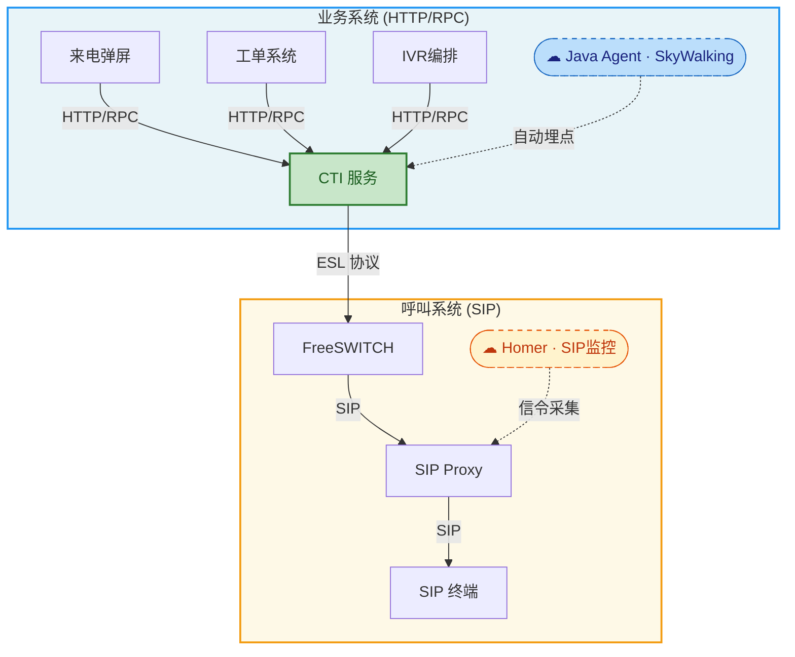
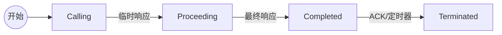
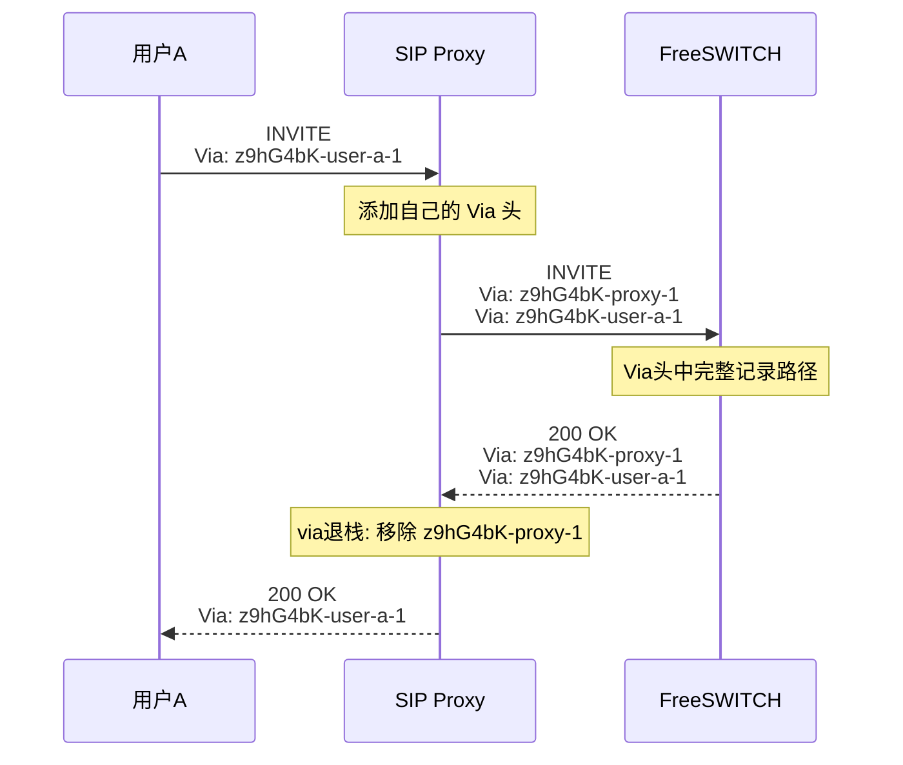
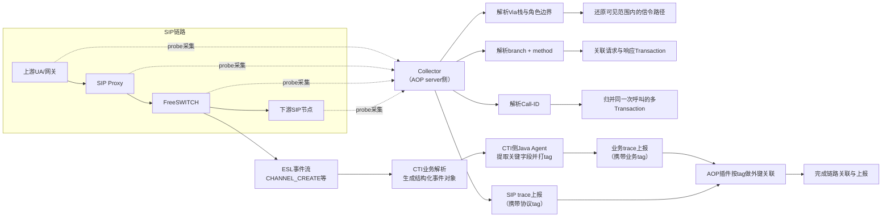
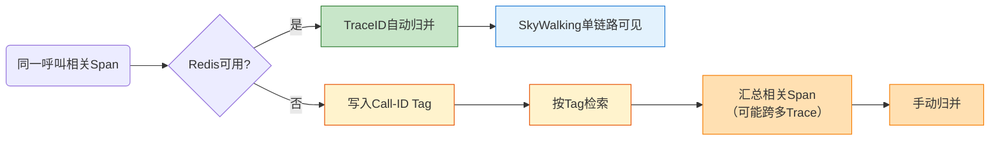

> 呼叫中心由SIP呼叫系统和HTTP/RPC业务系统两套异构体系组成，二者的可观测性链路天然割裂——APM看不见呼叫，SIP监控看不见业务。本文提出一种完全非侵入的联合关联方案：将SIP Transaction建模为Span，借助Via头还原信令路径，通过SkyWalking自定义插件在ESL事件处理的边界点捕获Call-ID，利用Redis缓存在运行时还原SIP侧Span的TraceID上下文，从而将信令链路与业务链路归并入同一条Trace；同时以Call-ID作为Span Tag进行兜底，在Redis不可用时仍可跨链路检索。整套方案无需改造任何通信组件或业务代码，已在生产环境验证，将跨系统排障时间从30分钟级缩短至秒级。

## 1. 被忽视的鸿沟：呼叫系统与业务系统之间的可观测性断层

现代分布式架构显著提升了系统的灵活性与可扩展性，却也引入了前所未有的复杂性。当一次用户请求需要跨越十几个微服务才能完成时，端到端的可观测性便成为保障系统稳定运行的生命线。在主流的微服务体系中，以SkyWalking、Jaeger为代表的APM系统已经构建起了相当成熟的分布式链路追踪能力，工程师可以通过一条TraceID轻松还原一次请求的完整调用路径。然而，在呼叫中心这一特殊领域，情况远比想象中复杂。呼叫中心天然由两套异构系统组成——基于SIP协议的呼叫系统和基于HTTP/RPC协议的业务系统。前者负责信令交互与媒体控制，后者承载业务逻辑与数据处理。两者各自拥有独立的监控体系，却在观测层面彼此隔绝，形成了一道难以逾越的"可观测性鸿沟"。当生产环境出现问题时，工程师不得不在两套毫无关联的监控系统之间来回切换，手工拼凑线索，试图还原一次完整呼叫的全貌。这个过程耗时、低效且极易遗漏关键信息。

本文将分享我们在呼叫中心场景下，如何以完全非侵入的方式，基于SIP报文的协议特性、ESL事件的关联能力和Java Agent的插件扩展机制，实现呼叫系统与业务系统之间链路追踪的端到端打通。整套方案无需改造链路上的任何通信组件，也无需对现有的APM系统做侵入式定制，是一条经过生产验证的、可复制的实践路径。

### 1.1 两个平行世界：呼叫系统与业务系统的架构差异

要理解这个问题的根源，首先需要了解呼叫中心的系统架构本质。一个典型的呼叫中心系统由两大核心部分组成：呼叫系统与业务系统。二者在通信协议、运行时环境和监控基建上存在根本性差异，可以说是两个"平行世界"。呼叫系统工作在电信协议栈之上，核心通信协议为SIP（Session Initiation Protocol，会话发起协议）。SIP负责建立、修改和终止多媒体会话，是VoIP领域的事实标准。呼叫系统的组件通常包括：

- **SIP终端**（如IP话机、软电话）：发起和接收呼叫
- **SIP代理/注册服务器**（如OpenSIPS、Kamailio）：负责信令路由与用户注册
- **媒体服务器**（如FreeSWITCH、Asterisk）：负责语音流的处理与转码
- **信令监控系统**（如Homer）：专门用于SIP信令的抓取、存储和分析

业务系统则是标准的微服务架构，工作在HTTP/RPC协议之上。它承载着呼叫中心的核心业务逻辑，包括来电弹屏、工单创建、客户信息查询、IVR流程编排等功能。业务系统的可观测性由传统APM工具（如SkyWalking、Pinpoint）提供支撑，通过Java Agent自动埋点，实现方法级别的链路追踪。

在这两套系统之间，通常存在一个关键的中间层CTI（Computer Telephony Integration，计算机电话集成）服务。CTI是呼叫控制的核心枢纽，它通过ESL（Event Socket Library）协议与FreeSWITCH等媒体服务器建立连接，接收呼叫事件（如振铃、应答、挂机）并向媒体服务器下发控制指令。同时，CTI以HTTP/RPC接口的形式向上层业务系统暴露呼叫控制能力。可以说，CTI既是呼叫系统的"大脑"，也是连接呼叫世界与业务世界的唯一桥梁。



在这套架构下，业务系统一侧，SkyWalking通过Java Agent对CTI服务及上层微服务进行自动埋点，生成完整的HTTP/RPC调用链；呼叫系统一侧，Homer通过镜像抓包或HEP协议采集SIP信令，提供信令级别的呼叫追踪。两套监控体系各司其职，却泾渭分明、互不相通。这正是问题的起点：在实际生产运维中，这种"两套系统、两套监控"的割裂状态带来了巨大的排障成本。

### 1.2 端到端追踪的断裂

>设想一个典型的排障场景：一位客户来电反馈通话过程中听到了异常的语音提示，随后被错误地转接到了其他队列。运维工程师需要回答一个简单的问题这次通话到底经历了什么？

在业务系统一侧，工程师可以通过SkyWalking找到某次IVR编排请求的完整调用链，清晰地看到每个微服务节点的处理耗时和返回结果。但当调用链走到CTI服务调用FreeSWITCH的边界时链路戛然而止，SkyWalking的Trace在这里到达了终点。在呼叫系统一侧，工程师可以通过Homer查看SIP信令的交互过程，看到INVITE、180 Ringing、200 OK等信令的完整时序。但Homer只知道SIP层面发生了什么，完全不知道这次呼叫背后的业务系统做了哪些决策、触发了哪些服务调用。两条链路之间没有任何自动化的关联关系。工程师不得不采用最原始的方式：先在SkyWalking中根据时间戳和用户标识大致定位到可疑的调用链，再到Homer中根据主被叫号码和时间范围搜索对应的SIP会话，然后在两个系统的时间线上来回比对，试图手工拼凑出完整的事件序列。这个过程存在三个致命问题：

- **效率极低**：一次完整的排障往往需要30分钟到数小时，其中大部分时间花在跨系统的线索拼接上。遇到高并发时段，同一时间窗口内可能存在数百条呼叫记录，逐一比对近乎不可能。
- **容易遗漏**：由于两套系统的时钟精度、日志格式和数据保留策略各不相同，人工关联极易出现遗漏或误匹配，尤其是在涉及转接、会议等复杂呼叫场景时。
- **无法常态化**：这种手工排障方式完全依赖工程师的个人经验，无法沉淀为自动化的监控能力，更不可能基于全链路数据做实时告警和趋势分析。



> 图：跨系统排障时间主要耗在“切系统 + 拼时间线”，上线联合关联后总耗时显著下降。

### 1.3 现有工具的局限

我们也调研了业界现有的解决方案，结论是没有现成的开源方案能够满足需求。传统APM系统（SkyWalking、Jaeger、Zipkin等）的设计哲学建立在HTTP/RPC调用模型之上，它们擅长追踪方法调用的嵌套关系和服务间的远程调用链路。但SIP信令是一套完全不同的通信范式：它是基于事务（Transaction）的请求-响应模型，一次呼叫可能涉及多个并行的事务，信令路径上的每个节点都会主动修改消息头部。这些特性与传统APM的假设模型格格不入。而SIP专用的信令监控系统（如Homer、SIP3）虽然对SIP协议有深入的理解，但它们的视野仅限于信令层面，完全不具备与业务系统链路关联的能力。简而言之，APM系统看不见呼叫，SIP监控看不见业务，两者之间存在一片无人区。这正是我们要解决的核心问题。

## 2. 追本溯源：可观测性割裂的根因与理论分析

在设计解决方案之前，我们需要先回答几个根本性的问题：为什么呼叫系统和业务系统的可观测性会割裂？要打通它们，理论上需要解决哪些核心技术点？

### 2.1 割裂的本质

传统APM系统诞生于Web服务和微服务浪潮之中，其核心观测模型可以高度概括为：以方法调用的生命周期为Span，以Span的嵌套和串联构成Trace。具体来说：

- 一个Span代表一次有明确起止时间的操作，比如一次方法调用、一次数据库查询、一次HTTP请求。Span记录了操作名称、开始时间、结束时间、状态码以及可选的标签和日志。
- 当一个方法内部调用了另一个方法，就产生了父子Span关系（嵌套）；当一个服务通过HTTP/RPC调用另一个服务，就产生了跨进程的Span引用（串联）。
- 所有属于同一次用户请求的Span通过一个全局唯一的TraceID关联在一起，形成完整的调用链。

这套模型对HTTP/RPC世界非常有效，Java Agent可以通过字节码增强自动拦截方法入口和出口，HTTP客户端库可以在请求头中自动注入和提取TraceID，整个追踪过程对业务代码完全透明。但将这套模型套用到SIP呼叫系统时，会遇到根本性的障碍：

- SIP协议不在APM的拦截范围内。传统APM的Java Agent预置了对HTTP、gRPC、JDBC、Redis等协议的插件支持，但从未考虑过SIP协议。FreeSWITCH等媒体服务器通常是C/C++实现，根本不在Java Agent的观测范围内。
- 呼叫系统中不存在"方法调用"的概念。SIP的交互单元是信令消息（INVITE、ACK、BYE等），组织形式是事务（Transaction）和对话（Dialog），与面向对象编程中的方法调用模型截然不同。APM里"Span是一次方法调用"的基础假设在这里不成立。
- 没有行业惯例和理论基础。分布式链路追踪领域的核心论文（Google Dapper、OpenTelemetry规范）以及行业实践，几乎全部围绕Web服务展开。如何对SIP信令建模为Span？一次INVITE事务算一个Span还是一次完整呼叫算一个Span？这些问题既没有论文讨论，也没有行业惯例可循。

割裂的本质不是技术实现层面的缺失，而是观测理论本身从未覆盖过呼叫协议这一领域。要解决问题，必须先补齐理论基础。

### 2.2 Span 建模的理论基础

Span是分布式链路追踪体系中最基本的构建单元。根据OpenTelemetry规范，一个Span至少需要包含以下信息：

| 属性 | 说明 |
|------|------|
| TraceID | 全局唯一标识，关联同一条追踪链路上的所有Span |
| SpanID | 当前Span的唯一标识 |
| ParentSpanID | 父Span的标识，用于构建因果关系 |
| OperationName | 操作名称，如 `GET /api/user` |
| StartTime / EndTime | 起止时间，定义了Span的生命周期边界 |
| Status | 操作结果状态 |
| Tags / Attributes | 补充性的元数据，如 `http.method=GET` |

一个合格的Span必须具备两个核心特征：

1. **明确的边界**：有清晰的开始点和结束点，代表一个完整的、可度量的操作。
2. **可追溯的因果关系**：能够通过ParentSpanID构建与其他Span之间的上下游关系。

理解了这两个特征，我们就能回答"SIP世界中什么可以建模为Span"这个关键问题。答案将在方案部分揭晓，SIP Transaction天然满足这两个特征。

### 2.3 TraceID 跨系统关联的核心挑战

即使我们成功地在SIP侧定义了Span，还面临另一个核心问题：如何让SIP侧的Span与业务系统的Span共享同一个TraceID？在标准的APM工作流中，TraceID的生成和传播是这样工作的：

1. 入口服务（如API Gateway）在接收到用户请求时，生成一个全局唯一的TraceID。
2. 该TraceID通过HTTP Header（如 `sw8` 或 `traceparent`）传递给下游服务。
3. 下游服务从Header中提取TraceID，将其附加到本服务内产生的所有Span上。
4. 如此层层传递，整条调用链上的所有Span自然共享同一个TraceID。

然而在呼叫中心场景下，这条传播链在CTI服务调用FreeSWITCH的边界处断裂了：

- FreeSWITCH不是Java应用，没有Java Agent来自动提取和传播TraceID。
- ESL协议不是HTTP，无法在请求头中携带TraceID等追踪上下文。
- SIP协议更不可能携带APM的追踪头，即使能修改SIP消息头部，也意味着对链路上所有SIP组件的侵入式改造，违背了我们"非侵入"的核心原则。

更重要的是，主流APM系统都不建议用户自定义TraceID。以SkyWalking为例，TraceID的生成采用了雪花算法变体，编码了实例ID、线程ID、时间戳等信息，用于在存储和查询层面做优化。如果允许外部注入任意格式的TraceID，可能导致索引失效、ID冲突、存储性能下降等一系列问题。这也是SkyWalking社区长期拒绝"自定义TraceID"特性请求的根本原因。面对这一现状，强行让SIP系统"说APM的语言"显然不可行。我们需要换一个思路：不是强制统一TraceID，而是建立TraceID与呼叫标识之间的映射关系，在查询时动态关联。这个思路将贯穿整个方案的设计。

## 3. 破局之道：SIP报文、ESL事件与Java Agent的三层联合方案

在完成理论分析之后，我们提出了一套"三层联合"的关联方案。整套方案分为四个关键设计，逐一解决从Span建模、链路还原、ID关联到数据融合的全部问题。

### 3.1 基于 SIP Transaction 的生命周期观测

回到分析部分提出的核心问题——SIP世界中，什么可以建模为Span？答案是：SIP Transaction（SIP事务）。

#### 3.1.1 Transaction天然具有完整的调用边界

根据RFC 3261的定义，一个SIP Transaction由一个请求（Request）和与之对应的一个或多个响应（Response）组成。例如：

- INVITE Transaction：以INVITE请求开始，经历100 Trying → 180 Ringing → 200 OK的响应序列，直到收到最终响应。
- BYE Transaction：以BYE请求开始，以200 OK响应结束。
- REGISTER Transaction：以REGISTER请求开始，以200 OK响应结束。

每个Transaction都有明确的起始点（请求发出）和明确的结束点（收到最终响应），具有天然的生命周期边界。这与Span对"一个完整操作单元"的定义高度吻合。我们可以直接建立映射关系：

| SIP概念 | 追踪概念 | 说明 |
|---------|---------|------|
| Transaction | Span | 一次完整的请求-响应交互 |
| Transaction起始时间 | Span StartTime | 请求发出的时间 |
| Transaction结束时间 | Span EndTime | 收到最终响应的时间 |
| 请求方法（INVITE/BYE等） | OperationName | 操作类型标识 |
| 响应状态码（200/486等） | Status | 操作结果 |

#### 3.1.2 事务状态机的可观测性价值

SIP Transaction内部运行着一个精确定义的状态机（RFC 3261 Section 17）。以INVITE客户端事务为例，其状态流转为：



每一次状态迁移都对应着一个具体的信令事件（收到临时响应、收到最终响应、收到ACK等），并且伴随着精确的定时器管理。这意味着我们可以像观测一个方法调用的进入、处理、返回一样，观测一个SIP Transaction的发起、进展、完成和终止。事务状态机为Span提供了比方法调用更加丰富的中间状态信息，我们不仅知道一次操作的开始和结束，还能精确知道它经历了哪些中间阶段、在每个阶段停留了多长时间。

#### 3.1.3 基于协议字段的天然SpanID

在传统APM中，SpanID由追踪系统生成，用于唯一标识一个Span。而在SIP协议中，RFC 3261已经为我们准备好了现成的标识符：

- **Via头部的branch参数**：RFC 3261规定，branch参数必须以`z9hG4bK`开头，并且在全局范围内保持唯一。它的设计初衷就是用于唯一标识一个Transaction，使得SIP代理能够将响应匹配回对应的请求。
- **Transaction-ID**：由Via头的branch值加上CSeq方法名共同确定，能够唯一标识一个事务。

```sip
INVITE sip:bob@example.com SIP/2.0
Via: SIP/2.0/UDP client.atlanta.example.com:5060;branch=z9hG4bK776asdhds
Max-Forwards: 70
From: "Alice" <sip:alice@atlanta.example.com>;tag=1928301774
To: <sip:bob@example.com>
Call-ID: a84b4c76e66710@client.atlanta.example.com
CSeq: 314159 INVITE
Contact: <sip:alice@client.atlanta.example.com:5060>
Content-Length: 0
```

> RFC 3261, Section 17.1.3:
> "The branch parameter in the top Via header field is used for this purpose. A response matches a client transaction under two conditions: (1) If the response has the same value of the branch parameter in the top Via header field as the branch parameter in the top Via header field of the request that created the transaction. (2) If the method parameter in the CSeq header field matches the method of the request that created the transaction."
>
> RFC 3261, Section 17.2.3:
> "The branch parameter in the topmost Via header field of the request is examined. If it is present and begins with the magic cookie \"z9hG4bK\" ... the request matches a transaction if: (1) the branch parameter in the request is equal to the one in the top Via header field of the request that created the transaction ... and (3) the method of the request matches the one that created the transaction, except for ACK, where the method of the request that created the transaction is INVITE."

按工程实现可概括为：在 `branch` 含 `z9hG4bK` 的前提下，事务匹配主要依赖 `top Via.branch` 与 `method`（响应侧体现为 `CSeq.method`）；服务端还会额外校验 `top Via.sent-by`。

branch参数的唯一性和事务绑定特性，使其天然适合作为SIP链路追踪中的SpanID，无需我们额外生成或注入任何标识符。这是一个关键洞察：SIP协议的设计者在30年前就已经为事务追踪提供了机制，只是从未有人将其与分布式追踪的Span模型关联起来。

### 3.2 利用Via头实现SIP通信的无侵入链路跟踪

解决了"什么是Span"和"什么是SpanID"之后，下一个问题是：如何还原SIP信令在各组件之间的传递路径，构建完整的调用链？这里需要先理解SIP信令的Via头传递机制。

#### 3.2.1 Via头的工作原理

SIP协议规定，当一个请求经过一个代理服务器（Proxy）时，代理必须在请求中添加一个自己的Via头部，并在转发之前将其置于所有已有Via头的最顶部。当响应沿原路返回时，每经过一个代理，该代理移除最顶部的Via头（即自己之前添加的那个），然后将响应转发给下一跳。这就像在信里嵌套信封：每经过一站，就多套一层信封（记录本站地址）；回程时，每经过一站就拆掉最外层的信封，自然知道下一站该寄往何处。以一个典型的呼叫流程为例：



#### 3.2.2 Via头信息的获取方式

Via头机制带来了一个重要结论：SIP信令天然携带事务关联信息，但SIP报文的采集与解析不应放在CTI侧Agent完成。实际工程中，SIP采集覆盖整条信令链路（因为问题可能发生在任一环节），由部署在各节点的probe统一上送到AOP server侧的collector进行解析；CTI侧先完成ESL事件结构化，Java Agent仅在message handler切点提取关键字段并写入tag，AOP server插件再按tag做关联。

这一区分很关键：业务通常在`CHANNEL_CREATE`事件就开始，而可用于路径还原的SIP关键信息往往在会话建立阶段才完整出现。因此，Via/branch/CSeq的解析由collector异步完成更合理，Agent侧只消费解析结果而不承担SIP协议解析职责。



1. **UAS场景可还原上游路径**：当FreeSWITCH作为UAS接收请求时，请求中的Via栈可直接反映上游经过节点。
2. **UAC场景以事务关联为主**：当FreeSWITCH作为UAC发起请求时，本侧通常无法仅凭Via反推出完整下游链路，但仍可用`branch + method`稳定关联请求与响应Transaction。
3. **Call-ID负责跨Transaction归并**：INVITE、ACK、BYE等Transaction可通过Call-ID归并为同一呼叫会话。

整个过程不需要改造链路上的任何SIP组件：Proxy、FreeSWITCH、SIP终端都按照RFC 3261标准行为工作，Via头的添加和移除是协议本身的强制要求。我们做的是在链路侧通过probe采集、在collector侧统一解析、在CTI侧用Agent提取结构化事件并打tag、在AOP侧按tag做关联。这样既保留了"非侵入"，又避免了在CTI线程内做时序不稳定的SIP字段解析。

### 3.3 基于Redis的TraceID上下文还原：让SIP Span归并入业务Trace

前面两个设计解决了SIP侧"如何建模Span"的问题，但还没有解决最核心的"跨系统关联"问题：如何让SIP侧的Span与业务系统的Span共享同一个TraceID，而不是在两个系统里各自形成孤立的链路？这是整套方案中唯一需要做"工程定制"的环节，但我们的目标依然是将侵入性降到最低。

#### 3.3.1 关联的契机：CTI消息处理边界与AOP关联边界

这里需要先明确一个边界：**ESL事件的解析与结构化不是SkyWalking完成的，而是CTI自身业务逻辑完成的**。CTI先将原始ESL报文转换为结构化事件对象（包含Call-ID、通道状态、主被叫等字段），随后SkyWalking Java Agent只是切到message handler的切点，读取这份“已结构化对象”。

因此，跨系统关联依赖的关键信息来源可以拆成两类：

- **CTI侧结构化ESL对象中的业务键**：如Call-ID/Unique-ID、主被叫、事件类型等（由CTI业务解析后产出）
- **SIP侧上报trace中的协议键**：由SIP采集/解析链路产出的Call-ID、Via/branch/CSeq等标签

Agent在CTI侧做的事情是把前一类业务键提取出来，写入当前业务trace的tag；AOP server侧插件做的事情是读取这些tag并做外键关联。也就是说，AOP插件并不负责ESL解析，它消费的是“已随trace上报的tag数据”。

#### 3.3.2 SkyWalking插件的外键关联机制

我们在两侧分别做了最小增强：CTI侧Agent负责“提取并打tag”，AOP server侧插件负责“读取tag并关联”。

**阶段A：CTI侧（Java Agent）提取结构化事件并打tag**

1. 在CTI的message handler切点织入增强逻辑。
2. 从CTI已解析好的ESL事件对象中提取Call-ID/Unique-ID等关键业务字段。
3. 将这些字段写入当前业务trace的tag，作为业务自定义关联键上报。

**阶段B：AOP server侧（SkyWalking插件）按tag做外键关联**

1. 在AOP server的trace处理链路读取上报tag（业务侧tag + SIP侧tag）。
2. 以Call-ID等键在Redis中建立/查询外键映射（如 `Call-ID -> TraceID`）。
3. 命中映射后，仅对**SIP侧上报trace数据**执行关联修正（补充或重写关联字段），将SIP Span归并到业务链路。

这套机制的关键点是职责清晰：CTI业务负责ESL结构化，Agent负责低侵入提取和标注，AOP插件负责后端关联与SIP侧数据归并。工程师最终在SkyWalking中看到的是同一通呼叫下业务链路与SIP链路的统一视图。

```
Redis Key 设计：
  Key:    call-trace:{Call-ID}
  Value:  {TraceID}
  TTL:    7200s

示例：
  Key:    call-trace:f81d4fae-7dec-11d0-a765-00a0c91e6bf6
  Value:  a1.2345.6789012345.abc
  TTL:    7200s
```

整个过程对业务代码零侵入，我们没有修改CTI业务代码，也没有把ESL解析逻辑迁移到观测系统里；只是在CTI侧通过Agent做切点增强、在AOP侧通过插件做tag关联。这是"非侵入"的第二层含义：利用插件扩展能力，而非改写业务实现。选择Redis作为外键缓存组件，基于以下几点考量：

- **高读写性能**：一通电话可能产生多个ESL事件，每个事件都需要一次Redis读写，Redis的性能可以轻松支撑高并发的呼叫中心场景。
- **TTL自动过期**：呼叫结束后映射关系不再需要，Redis的TTL机制天然满足这一需求，无需额外的清理逻辑。
- **运维成本低**：绝大多数呼叫中心系统已经在使用Redis，不需要引入额外的基础组件。



> 图：该图度量的是CTI消息处理链路在“切点增强+tag提取”前后的延迟分位变化（P50/P95/P99）；不代表SkyWalking后端存储/查询链路的延迟。

至此，两个"平行世界"之间的追踪上下文正式打通。** SIP Transaction Span与业务HTTP/RPC Span共享同一个TraceID，在SkyWalking中呈现为一条完整的混合链路。

### 3.4 以Call-ID为Span Tag兜底：应对Redis不可用与历史追溯

TraceID上下文还原机制（第三个设计）在正常情况下工作良好，但它依赖Redis的实时可用性：如果Redis在某通呼叫的关键时刻不可用，插件将无法查到已存储的TraceID，ESL事件对应的SIP Span就会以一个新的TraceID孤立上报，与原有的业务链路脱离关联。此外，Redis的TTL设置（如2小时）意味着超长会议呼叫或需要在数天后追溯的历史排障场景，映射数据可能已经过期。为此，我们在插件中引入了一个轻量级的兜底机制：无论TraceID替换是否成功，插件都会将Call-ID以Span Tag的形式记录在当前Span上。

#### 3.4.1 兜底查询路径

当TraceID统一正常工作时，工程师在SkyWalking中通过任意一个TraceID都能看到该次呼叫的完整混合链路，SIP Span与业务Span同属一条Trace，无需额外操作。当TraceID统一失败（Redis不可用或TTL过期）时，SIP Span与业务Span会分属不同的TraceID。此时工程师仍可通过SkyWalking的Tag搜索功能，以Call-ID为关键字检索出所有携带该Call-ID Tag的Span，横跨多条Trace进行手动关联，这个过程虽然比直接查TraceID多一步，但整个技术栈仍然只需要访问SkyWalking一个系统。



#### 3.4.2 设计价值

这一设计的核心价值在于将关联能力从"依赖Redis可用"降级为"依赖SkyWalking可用"。而SkyWalking本身就是整套方案的核心存储，其可用性远高于作为旁路缓存的Redis。换句话说，Redis是加速关联的快速通道，Tag是不依赖任何额外组件的保底手段。这个设计理念可以概括为一句话：主路径依靠TraceID统一做无缝合并，旁路兜底依靠业务ID的Tag落点，两条路都在SkyWalking里走完，不引入第三个查询系统。



> 图：自动归并成功率持续提升，Tag 兜底占比和人工归并工单数逐步下降。

## 4. 从生产验证到未来演进：方案成效与展望

### 4.1 设计哲学与方案回顾

回顾整套方案，我们通过四个关键设计，在完全非侵入的前提下，实现了呼叫系统与业务系统之间可观测性链路的端到端打通：

| 设计 | 解决的问题 | 非侵入性体现 |
|------|-----------|-------------|
| SIP Transaction建模为Span | 呼叫系统缺乏观测理论基础 | 利用RFC 3261已有的事务模型，无需引入新概念 |
| Via头还原信令路径 | SIP链路追踪缺乏TraceID传播机制 | 利用SIP协议自身的Via头栈机制，不改造任何SIP组件 |
| 基于Redis的TraceID上下文还原 | SIP Span与业务Span分属不同TraceID，无法归并为同一条链路 | 通过AOP server侧SkyWalking插件机制增强，不修改业务代码 |
| Span Tag业务ID兜底 | Redis不可用或TTL过期时的关联失效风险 | 在SkyWalking内部通过Tag实现跨Trace检索，不引入额外查询系统 |

用数据治理的话来概括这四个设计的共通思路，它们遵循的是同一条原则：不要求各方改造自身的标识体系，而是在协议边界处主动完成上下文的拼接与还原。

这个思路在大数据领域有清晰的对应物。数据仓库的星型模型、数据湖的Schema-on-Read，都秉持同一种哲学：数据源各自保持原生格式，不在入库时强制转换；关联所需的外键随数据一起落盘，真正的聚合在需要时按需触发。我们的方案本质上是这个哲学在运行时链路领域的实践，只不过数据仓库的"聚合时机"在查询时，而我们的"聚合时机"在每个新ESL事件的处理边界处：插件实时查询Redis，用Call-ID换回TraceID，当场完成上下文的重新归属。Redis在这里扮演的角色，与数据湖中连接异构数据源的外键映射表如出一辙。

这条思路的适用范围远不止呼叫中心。任何由异构协议栈组成的复合系统，物联网中MQTT与HTTP的交汇、工业控制中OPC UA与IT系统的集成、车联网中V2X协议与云端服务的衔接，都面临着相似的可观测性割裂问题。它们的共性在于：一侧是领域专用协议，有自身完备的标识体系和生命周期模型；另一侧是通用的Web服务体系，有成熟的APM基建。解法也是相通的：找到两侧各自的"天然标识符"，在协议边界处捕获映射关系并存入轻量级缓存；当领域侧的Span进入APM时，用缓存中的外键将其归并到已有的业务Trace里。 不需要改造任何一侧的协议栈，不需要发明新的统一追踪格式，只需要一个边界处的上下文还原动作。

### 4.2 方案的边界与已知局限

在展示方案成效之前，我们认为有必要先坦诚讨论当前方案的边界和局限。一个方案的价值不仅体现在它解决了什么问题，更体现在它清楚地知道自己没有解决什么问题。

**复杂呼叫场景下的Call-ID扇出问题。** 当前方案假设一通电话对应一个主要的Call-ID。但在转接、会议、盲转等复杂场景下，FreeSWITCH会为新的呼叫腿（call leg）生成新的Call-ID，形成一对多的扇出关系。当前方案可以通过ESL事件中的`Other-Leg-Unique-ID`字段捕获关联的Call-ID并一并写入Redis，但在涉及多方多次转接的极端场景下，这种链式关联的完整性仍有待验证。

**Redis映射的生命周期管理。** 我们为Redis映射设置了2小时的TTL，覆盖了绝大多数呼叫场景。但对于偶发的超长会议呼叫，或者需要在事后数天进行追溯分析的场景，Redis中的映射可能已经过期。目前的应对策略是将映射关系同步落盘到日志中作为兜底，但尚未实现自动化的历史回溯查询。

**SIP侧Span的粒度取舍。** 我们选择将SIP Transaction作为Span的基本单元，这是一个在实用性和精确性之间的折中。理论上，还可以将Dialog（由多个Transaction组成的完整会话）建模为更高层级的Span，将单条SIP消息建模为更细粒度的Event。但在当前的生产实践中，Transaction级别的粒度已经能够满足绝大多数排障需求，更细的粒度会带来数据量的急剧膨胀，性价比不高。

**Redis不可用时的降级路径。** TraceID上下文还原依赖Redis的实时可用性。当Redis短暂故障时，插件无法查到已存储的TraceID，当前ESL事件对应的SIP Span将以一个新TraceID孤立上报，无法自动归并到业务链路中。此时方案自动降级到第四个设计——以Call-ID Span Tag为索引，在SkyWalking内执行跨Trace的Tag检索，完成手动关联。虽然比直接查TraceID多一个步骤，但整个排障过程仍在SkyWalking一个系统内完成，不需要切换到其他工具。可通过Redis主从复制或集群模式降低此类故障的发生概率。



> 图：普通呼叫场景可稳定自动归并；会议/盲转/超长通话场景需要更强兜底或人工介入。

### 4.3 生产实战：一次排障的前世今生

理论分析和工程设计讲得再周全，最终要回到一个朴素的问题：方案上线后，实际效果到底怎么样？我们用一个真实的排障案例来回答这个问题。

#### 4.3.1 方案上线前：30分钟的拼图游戏

某工作日下午，客服团队反馈多位客户来电后听到了错误的IVR语音菜单，随后被转接到了不匹配的技能组。运维工程师接到告警后开始排查。

第一步，在SkyWalking中搜索IVR编排服务最近一小时的异常调用链。问题是，IVR服务每分钟处理上百次请求，其中大部分是正常的——工程师需要逐条检查调用链中的参数和返回值，寻找与"错误菜单"匹配的异常模式。这一步花了约10分钟，最终定位到若干条可疑的Trace。

第二步，工程师需要确认这些可疑的业务调用对应的是哪些具体的来电，以及呼叫信令层面是否也存在异常（比如是否发生了意外的re-INVITE或REFER）。于是切换到Homer，根据时间范围和主被叫号码模糊搜索。由于客服团队最初反馈的信息不够精确，时间范围只能圈定到"下午两点到三点之间"，这个区间内有数百条SIP会话记录。工程师只能逐一打开检查信令时序，试图将SIP会话与SkyWalking中的可疑Trace对应起来。这一步又花了近15分钟。

第三步，最终确认了问题呼叫后，工程师将SIP层面的信令事件时间线和业务层面的服务调用时间线手工对齐，发现IVR编排服务在特定条件下返回了错误的技能组ID，而FreeSWITCH忠实地按照这个错误ID执行了转接。根因是IVR配置缓存的一次异常刷新。

整个排障过程耗时约35分钟，其中超过70%的时间花在了"在两个系统之间来回比对、拼凑线索"上。

#### 4.3.2 方案上线后：秒级的端到端还原

同样的场景在方案上线后再次发生时，排障过程截然不同。

工程师直接在SkyWalking中检索异常工单对应的TraceID。由于SkyWalking插件已在运行时完成了TraceID上下文还原，这条Trace里同时包含了业务层的HTTP/RPC调用链和经由ESL映射过来的SIP Transaction Span。工程师在同一个时间轴上看到了这通电话从信令建立、IVR交互、业务决策到最终转接的全过程——IVR编排服务在哪个节点返回了错误结果、错误结果如何经由CTI传递到FreeSWITCH、FreeSWITCH又是如何基于这个结果生成了转接信令——整条因果链在SkyWalking的单一界面内一目了然，无需跨系统跳转。从发现问题到定位根因，不到2分钟。

这个对比不是孤例。方案上线三个月以来，涉及跨系统排障的工单平均处理时间从原来的28分钟下降到了4分钟以内，其中大部分时间花在了确认修复方案而非定位问题上。更重要的是，我们基于全链路关联数据建立了一系列自动化告警规则，例如：



> 图：上线后 8 周内 MTTR 持续下降，一次定位成功率持续上升。

- 当SIP会话出现486 Busy Here响应，且对应的业务链路中CTI的坐席状态查询返回"空闲"时，自动触发告警，这通常意味着坐席状态同步出现了不一致。
- 当某个IVR节点的业务处理耗时超过阈值，且SIP侧同时出现了重传（retransmission）时，自动关联并标记为"IVR响应超时导致的信令异常"。

这些告警规则在过去无法实现，因为它们的触发条件横跨两套系统，单独看任何一侧的数据都无法判定异常。全链路关联不仅缩短了排障时间，更从根本上改变了运维团队的工作模式：从被动的事后排障，逐步走向主动的实时监控。

### 4.4 当前方案的适用边界

值得强调的是，这套方案并非银弹，它有明确的最佳适用场景和前提条件：

**适用场景**：以FreeSWITCH（或类似的可通过ESL/AMI等接口对接的媒体服务器）为核心的呼叫中心系统，且业务层已部署SkyWalking或其他支持插件扩展的Java APM。

**前提条件**：CTI服务是Java应用（或至少运行在支持Agent机制的JVM语言上）；系统中存在可用的Redis实例；SkyWalking已在CTI服务上部署并正常采集链路数据。

**不适用的场景**：纯SIP-to-SIP的运营商级信令追踪（没有业务系统参与，缺少业务侧TraceID锚点）；CTI服务为非JVM语言实现且不支持类似Agent机制的场景（此时需要考虑其他注入方式，如Sidecar模式）；以及FreeSWITCH与CTI之间不使用ESL协议对接而是通过其他方式（如直接SIP B2BUA）集成的场景。

### 4.5 未来演进路线

当前方案解决了"从0到1"的关联问题，但呼叫中心全链路可观测性的建设远不止于此。我们将未来的演进规划为三个阶段，从近期可落地的工程优化，到中期的能力拓展，再到远期的智能化探索。

#### 4.5.1 近期：统一看板与媒体质量纳入

虽然SIP Span与业务Span已经归并在同一条Trace里，SkyWalking原生的Trace视图是以调用链嵌套树的形式展示的，对于"信令时序图"这类面向呼叫领域的视角支持有限。近期的首要目标是在SkyWalking之上构建一个呼叫专属的可观测性看板：从同一条Trace中提取SIP Transaction Span和业务Span，分别渲染为信令时序图（lader diagram）和调用链瀑布图，并叠加在统一的时间轴上。技术上，这通过对SkyWalking查询结果的二次处理即可实现，工程复杂度可控，且无需依赖任何外部信令监控系统。

与此同时，我们计划将RTP媒体流的质量指标纳入关联体系。当前方案覆盖了信令面（SIP）和业务面（HTTP/RPC），但尚未触及媒体面（RTP）。通话质量问题：单通、断续、回声、噪音，往往与媒体流的质量直接相关，而RTCP报告中已经包含了丰富的质量指标（抖动、丢包率、往返时延等）。通过将RTCP数据与SIP Call-ID关联，再借助已有的Call-ID → TraceID映射，可以实现信令-业务-媒体三维度的关联分析。例如，当客户投诉"通话中有断续"时，工程师可以一次性看到：信令层面呼叫是否正常建立、业务层面IVR和转接逻辑是否正确执行、媒体层面RTP流的丢包率是否异常——三个维度的信息在同一个查询中呈现。

#### 4.5.2 中期：向OpenTelemetry社区推动SIP语义约定

在分析章节中，我们指出"割裂的本质不是技术实现层面的缺失，而是观测理论本身从未覆盖过呼叫协议这一领域"。当前方案在工程层面解决了这个问题，但理论层面的空白仍然存在，OpenTelemetry的语义约定（Semantic Conventions）中覆盖了HTTP、gRPC、数据库、消息队列等几乎所有主流协议，却没有SIP的一席之地。我们计划将本方案中"SIP Transaction建模为Span"的实践经验整理为提案，向OpenTelemetry社区提交SIP协议的语义约定草案，定义SIP Span的标准属性集（如`sip.method`、`sip.status_code`、`sip.call_id`、`sip.via.branch`等）。如果这一约定被社区采纳，意味着未来任何APM系统在处理SIP相关的Span时都将遵循统一的语义标准，也为SIP组件原生支持OpenTelemetry埋下了伏笔。这不仅仅是一个社区贡献的愿景，它将我们的方案从"特定系统的工程hack"提升为"基于行业标准的规范化实践"，也让方案的可复制性大幅增强。

#### 4.5.3 远期：AI驱动的跨协议根因分析

随着全链路数据的打通，我们在生产环境中积累了大量的跨系统关联数据——每一通电话的完整生命周期，从SIP信令的每一次交互、到IVR和转接的每一个业务决策、到CTI的每一次状态变更，都以关联的形式存储在系统中。这为智能化分析提供了前所未有的数据基础。但在这一方向上，挑战同样显著。传统的APM异常检测算法主要面向同构的HTTP/RPC链路，其特征工程建立在"请求-响应延迟""错误率""吞吐量"等通用指标之上。而呼叫中心的异常模式往往是跨协议的复合特征：比如"SIP信令正常但IVR响应超时导致用户体验下降"、"坐席状态同步延迟导致SIP 486但业务侧显示空闲"。这类异常的特征需要同时从SIP时序、业务调用链和坐席状态三个维度中提取，传统的单一协议异常检测模型无法胜任。此外，标注数据的稀缺性也是一个现实障碍。呼叫中心的故障场景极其多样，且许多异常在第一次出现时连资深工程师都需要较长时间才能定性，更遑论形成结构化的标注数据集来训练模型。

我们的初步规划是从规则驱动的关联告警起步（如前文提到的跨系统告警规则），逐步积累经过人工确认的异常案例，构建呼叫中心领域的异常模式库。在数据累积到一定规模后，尝试引入无监督的异常检测方法，从全链路数据中自动发现偏离正常模式的呼叫，辅助工程师快速定位根因。从"事后人工排障"到"实时自动关联"，再到"智能主动预警"，这是一条渐进但清晰的演进路径。

### 4.6 结语

回到这篇文章的起点，我们要解决的是"呼叫系统和业务系统之间的可观测性鸿沟"。在探索解决方案的过程中，我们发现一个有趣的事实：弥合这道鸿沟所需要的核心元素，在各自的协议设计中早已存在。SIP的Via头和branch参数天然提供了链路追踪所需的路径记录和事务标识能力；ESL事件天然携带了将呼叫世界与业务世界关联起来的Call-ID；SkyWalking的插件机制天然支持在不侵入业务代码的前提下完成增强逻辑的织入。我们所做的，不是发明一套新的追踪系统，而是重新发现这些已有协议中被忽视的设计智慧，并用一条轻量级的"外键映射"将它们串联起来。
